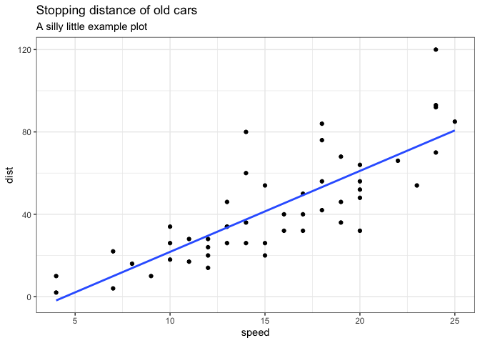
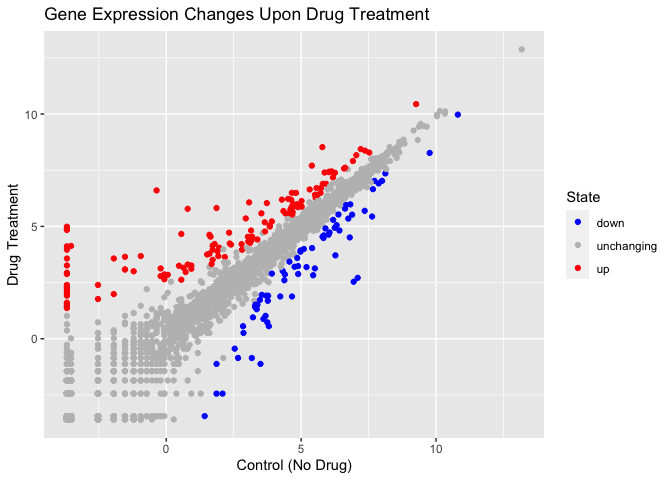

# Class05: Data Viz with ggplot
Anna Waters (PID: A16271985)

# Graphics Systems in R

There are many graphics systems in R for making plots and figures.

We have already played a little with **“base R’** graphics and the
`plot()` function.

Today we will start learning about a popular graphics package called
`ggplot2`.

This is an add on package - i.e. we need to install it. I install it
(like I install any package) with the `install.packages()` function.

``` r
plot(cars)
```


Before I can use the functions from a package I have to load up the
package from my “library”. We use the `library(ggplot2)` command to load
it up.

``` r
library(ggplot2)
ggplot(cars) 
```


Every ggplot is made up of at least 3 tings: - data (the numbers etc.
that will go into your plot) - aes (how the columns of data map to the
plot aesthetics) - geoms (how the plot actually looks, point, bars,
lines etc.)

``` r
ggplot(cars) +
  aes(x=speed, y=dist) +
  geom_point()
```


For simple plots ggplot is more verbose - it takes more code - than base
R plot.

Add some more layers to our ggplot:

``` r
ggplot(cars) +
  aes(x=speed, y=dist) +
  geom_point() +
  geom_smooth( method = "lm",se = FALSE) +
  labs(title = "Stopping distance of old cars",
       subtitle = "A silly little example plot") +
  theme_bw()
```

    `geom_smooth()` using formula = 'y ~ x'



Importing Genes Data Set for Gene Expression Plots

``` r
url <- "https://bioboot.github.io/bimm143_S20/class-material/up_down_expression.txt"
genes <- read.delim(url)
head(genes)
```

            Gene Condition1 Condition2      State
    1      A4GNT -3.6808610 -3.4401355 unchanging
    2       AAAS  4.5479580  4.3864126 unchanging
    3      AASDH  3.7190695  3.4787276 unchanging
    4       AATF  5.0784720  5.0151916 unchanging
    5       AATK  0.4711421  0.5598642 unchanging
    6 AB015752.4 -3.6808610 -3.5921390 unchanging

Learning about Genes Data set: Q1. Use the `nrow()` function to find out
how many genes are in this dataset. What is your answer? **5196**

Q2. Use the `colnames()` function and the `ncol()` function on the genes
data frame to find out what the column names are (we will need these
later) and how many columns there are. How many columns did you find?
**4 & Gene, Condition1, Condition2, State**

Q3. Use the table() function on the State column of this data.frame to
find out how many ‘up’ regulated genes there are. What is your answer?
**127**

Q4.Using your values above and 2 significant figures. What fraction of
total genes is up-regulated in this dataset? **2.44**

``` r
nrow(genes)
```

    [1] 5196

``` r
colnames(genes)
```

    [1] "Gene"       "Condition1" "Condition2" "State"     

``` r
table(genes$State)
```


          down unchanging         up 
            72       4997        127 

``` r
round(table(genes$State)/nrow(genes) * 100, 2)
```


          down unchanging         up 
          1.39      96.17       2.44 

Q. Complete the code below to produce the following plot

``` r
ggplot(genes) +
  aes(x=Condition1, y = Condition2) +
  geom_point()
```


Adding Colors to plot according to gene expression state w/ aes

``` r
p <- ggplot(genes) +
  aes(x=Condition1, y = Condition2, col= State) +
  geom_point() 

p
```


Changing the colors of the states to blue, grey & red

``` r
p + scale_color_manual(values = c("blue", "grey","red")) 
```


Q. Nice, now add some plot annotations to the p object with the `labs()`
function so your plot looks like the following:

``` r
p + scale_color_manual(values = c("blue", "grey","red")) +
  labs(title = "Gene Expression Changes Upon Drug Treatment") +
  xlab("Control (No Drug)") +
  ylab("Drug Treatment")
```



Reading in data set

``` r
# File location online
url <- "https://raw.githubusercontent.com/jennybc/gapminder/master/inst/extdata/gapminder.tsv"

gapminder <- read.delim(url)
```

``` r
library(dplyr)
```


    Attaching package: 'dplyr'

    The following objects are masked from 'package:stats':

        filter, lag

    The following objects are masked from 'package:base':

        intersect, setdiff, setequal, union

``` r
gapminder_2007 <- gapminder %>% filter(year==2007)
```

Q. Complete the code below to produce a first basic scater plot of this
gapminder_2007 dataset:

``` r
ggplot(gapminder_2007) +
  aes(x=gdpPercap, y = lifeExp) +
  geom_point()
```


Adjusting point transparency

``` r
ggplot(gapminder_2007) +
  aes(x=gdpPercap, y = lifeExp) +
  geom_point(alpha=0.5)
```


Adding color due to continent and point size due to population

``` r
ggplot(gapminder_2007) +
  aes(x=gdpPercap, y=lifeExp, color=continent, size=pop) +
  geom_point(alpha=0.5)
```


Using color gradient to represent population size

``` r
ggplot(gapminder_2007) + 
  aes(x = gdpPercap, y = lifeExp, color = pop) +
  geom_point(alpha=0.8)
```


Setting point size to represent population

``` r
ggplot(gapminder_2007) + 
  aes(x = gdpPercap, y = lifeExp, size = pop) +
  geom_point(alpha=0.5)
```


Scaling the point sizes to accurately represent size difference

``` r
ggplot(gapminder_2007) + 
  geom_point(aes(x = gdpPercap, y = lifeExp,
                 size = pop), alpha=0.5) + 
  scale_size_area(max_size = 10)
```


Q. Can you adapt the code you have learned thus far to reproduce our
gapminder scatter plot for the year 1957? What do you notice about this
plot is it easy to compare with the one for 2007?

``` r
gapminder_1957 <- gapminder %>% filter(year==1957)

ggplot(gapminder_1957) +
  aes(x=gdpPercap, y = lifeExp, col= continent, size = pop) +
  geom_point(alpha= 0.7) +
  scale_size_area(max_size = 10)
```


Do the same steps above but include 1957 and 2007 in your input dataset
for ggplot(). You should now include the layer facet_wrap(~year) to
produce the following plot

``` r
gapminder_both <- gapminder %>% filter(year==1957 & 2007)

ggplot(gapminder_both) +
  aes(x=gdpPercap, y = lifeExp, col= continent, size = pop) +
  geom_point(alpha= 0.7) +
  scale_size_area(max_size = 10) +
  facet_wrap(~year)
```


