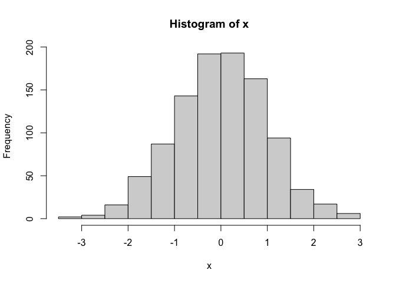
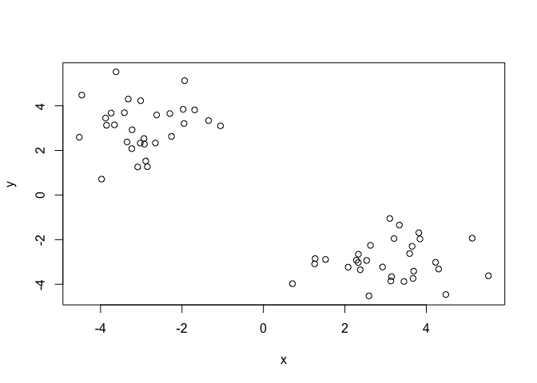
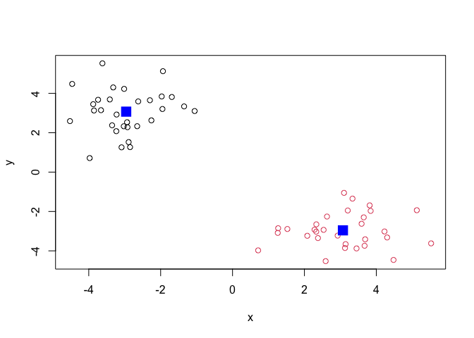
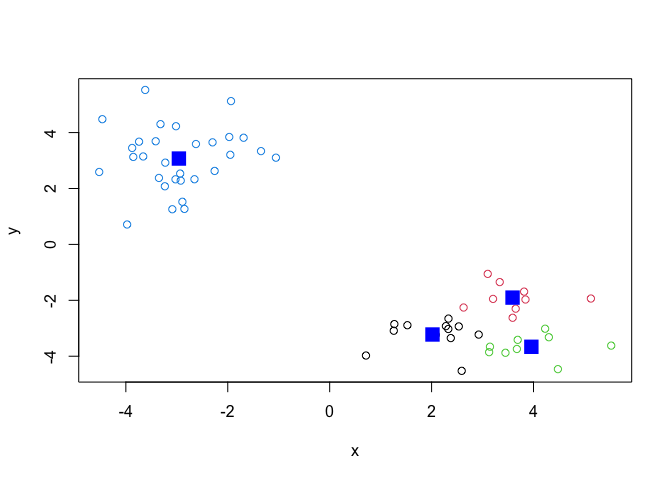
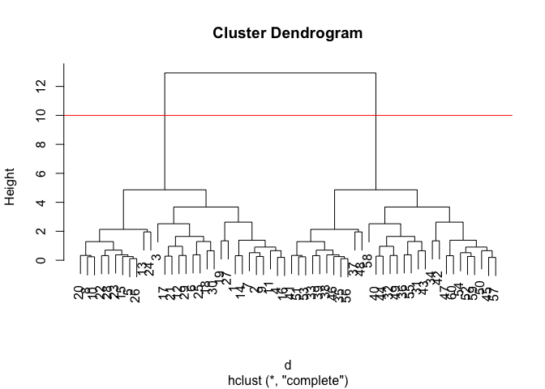
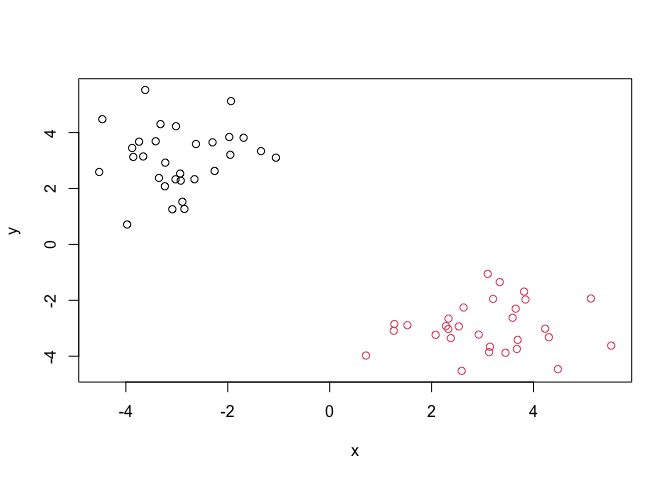
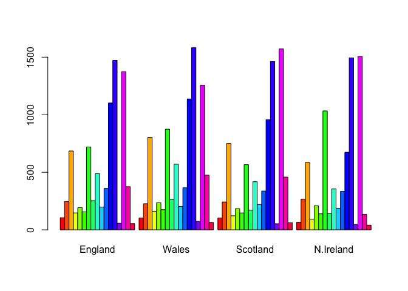
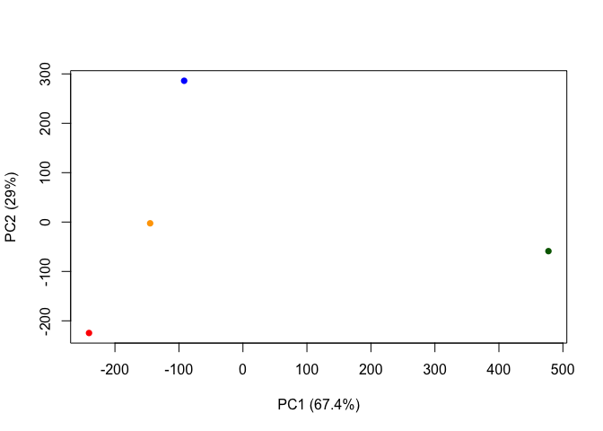
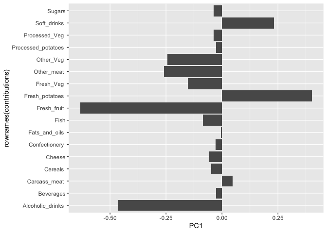

# class07: Machine Learning 1
Anna Waters (PID: A16271985)

\#Clustering Methods

The broad goal here is to find groups (clusters) in your input data

\##Kmeans

First, let’s make up some data to cluster

``` r
#rnorm generates a random data set that creates a normal distribution with 1000 points
x <- rnorm(1000)
hist(x)
```



Make a vector of length of 60 with 30 points cenetred on -3 and 30
points centered at +3

``` r
tmp <- c(rnorm(30, mean = -3), rnorm(30, mean = 3))
tmp
```

     [1] -3.3200149 -3.7407755 -1.9361339 -3.8542515 -2.9230026 -1.0545280
     [7] -3.4141594 -2.8506396 -3.8763636 -3.0878364 -3.2259363 -2.6241538
    [13] -3.9749149 -3.0160596 -2.9338202 -3.6593429 -1.9707134 -2.2576348
    [19] -3.6201695 -2.8903714 -1.6888767 -3.3504411 -2.6532396 -4.5228303
    [25] -1.3474146 -3.0254126 -4.4614421 -3.2339343 -2.2987564 -1.9501021
    [31]  3.2058854  3.6504018  2.0797144  4.4791826  2.3282383  3.3374296
    [37]  2.5908060  2.3312771  2.3769194  3.8156712  1.5250614  5.5247454
    [43]  2.6278843  3.8425120  3.1457644  2.5336004  4.2277980  0.7123877
    [49]  3.5905367  2.9241282  1.2579832  3.4495171  1.2690118  3.6899160
    [55]  3.1018438  2.2815773  3.1288608  5.1264578  3.6739663  4.3016878

I will now make a small x and y dataset with 2 groups of points.

``` r
x <- cbind(x=tmp, y =rev(tmp))
x
```

                   x          y
     [1,] -3.3200149  4.3016878
     [2,] -3.7407755  3.6739663
     [3,] -1.9361339  5.1264578
     [4,] -3.8542515  3.1288608
     [5,] -2.9230026  2.2815773
     [6,] -1.0545280  3.1018438
     [7,] -3.4141594  3.6899160
     [8,] -2.8506396  1.2690118
     [9,] -3.8763636  3.4495171
    [10,] -3.0878364  1.2579832
    [11,] -3.2259363  2.9241282
    [12,] -2.6241538  3.5905367
    [13,] -3.9749149  0.7123877
    [14,] -3.0160596  4.2277980
    [15,] -2.9338202  2.5336004
    [16,] -3.6593429  3.1457644
    [17,] -1.9707134  3.8425120
    [18,] -2.2576348  2.6278843
    [19,] -3.6201695  5.5247454
    [20,] -2.8903714  1.5250614
    [21,] -1.6888767  3.8156712
    [22,] -3.3504411  2.3769194
    [23,] -2.6532396  2.3312771
    [24,] -4.5228303  2.5908060
    [25,] -1.3474146  3.3374296
    [26,] -3.0254126  2.3282383
    [27,] -4.4614421  4.4791826
    [28,] -3.2339343  2.0797144
    [29,] -2.2987564  3.6504018
    [30,] -1.9501021  3.2058854
    [31,]  3.2058854 -1.9501021
    [32,]  3.6504018 -2.2987564
    [33,]  2.0797144 -3.2339343
    [34,]  4.4791826 -4.4614421
    [35,]  2.3282383 -3.0254126
    [36,]  3.3374296 -1.3474146
    [37,]  2.5908060 -4.5228303
    [38,]  2.3312771 -2.6532396
    [39,]  2.3769194 -3.3504411
    [40,]  3.8156712 -1.6888767
    [41,]  1.5250614 -2.8903714
    [42,]  5.5247454 -3.6201695
    [43,]  2.6278843 -2.2576348
    [44,]  3.8425120 -1.9707134
    [45,]  3.1457644 -3.6593429
    [46,]  2.5336004 -2.9338202
    [47,]  4.2277980 -3.0160596
    [48,]  0.7123877 -3.9749149
    [49,]  3.5905367 -2.6241538
    [50,]  2.9241282 -3.2259363
    [51,]  1.2579832 -3.0878364
    [52,]  3.4495171 -3.8763636
    [53,]  1.2690118 -2.8506396
    [54,]  3.6899160 -3.4141594
    [55,]  3.1018438 -1.0545280
    [56,]  2.2815773 -2.9230026
    [57,]  3.1288608 -3.8542515
    [58,]  5.1264578 -1.9361339
    [59,]  3.6739663 -3.7407755
    [60,]  4.3016878 -3.3200149

``` r
plot(x)
```



``` r
k <- kmeans(x,centers = 2)
k
```

    K-means clustering with 2 clusters of sizes 30, 30

    Cluster means:
              x         y
    1 -2.958776  3.071026
    2  3.071026 -2.958776

    Clustering vector:
     [1] 1 1 1 1 1 1 1 1 1 1 1 1 1 1 1 1 1 1 1 1 1 1 1 1 1 1 1 1 1 1 2 2 2 2 2 2 2 2
    [39] 2 2 2 2 2 2 2 2 2 2 2 2 2 2 2 2 2 2 2 2 2 2

    Within cluster sum of squares by cluster:
    [1] 57.84558 57.84558
     (between_SS / total_SS =  90.4 %)

    Available components:

    [1] "cluster"      "centers"      "totss"        "withinss"     "tot.withinss"
    [6] "betweenss"    "size"         "iter"         "ifault"      

Q1. From the results object, `k` how many points are in each cluster?

``` r
k$size
```

    [1] 30 30

Q2. What “component” of your resukt object details the cluster
membership?

``` r
k$cluster
```

     [1] 1 1 1 1 1 1 1 1 1 1 1 1 1 1 1 1 1 1 1 1 1 1 1 1 1 1 1 1 1 1 2 2 2 2 2 2 2 2
    [39] 2 2 2 2 2 2 2 2 2 2 2 2 2 2 2 2 2 2 2 2 2 2

Q3. Cluster centers?

``` r
k$centers
```

              x         y
    1 -2.958776  3.071026
    2  3.071026 -2.958776

Q. Plot of our clustering results

``` r
plot(x, col = k$cluster)
points(k$centers, col= "blue", pch =15, cex=2)
```



We can cluster into 4 groups

``` r
#K means
k4 <- kmeans(x,centers = 4)

#plot results
plot(x, col = k4$cluster)
points(k4$centers, col= "blue", pch =15, cex=2)
```



A big limitation of kmeans is that it does what you ask even if you ask
for silly clusters.

## Hierarchical Clustering

The main base R function for Hierarchical Clustering is `hclust()`.
Unlike `kmeans()` you can not just pass it your data as input. You first
need to calculate a distance matrix.

``` r
d <- dist(x)
hc <- hclust(d)
hc
```


    Call:
    hclust(d = d)

    Cluster method   : complete 
    Distance         : euclidean 
    Number of objects: 60 

Use `plot()` to view results

``` r
plot(hc)
abline(h=10, col= "red")
```



To make the “cut” and get our cluster membership ector, we can use the
`cutree()` function.

``` r
grps <- cutree(hc, h = 10)
grps
```

     [1] 1 1 1 1 1 1 1 1 1 1 1 1 1 1 1 1 1 1 1 1 1 1 1 1 1 1 1 1 1 1 2 2 2 2 2 2 2 2
    [39] 2 2 2 2 2 2 2 2 2 2 2 2 2 2 2 2 2 2 2 2 2 2

Make a plot of our data colored by hclust results

``` r
plot(x, col = grps)
```



## PCA of UK Food

Here we will do Principal Component Analysis (PCA) on some food data
from the UK.

``` r
url <- "https://tinyurl.com/UK-foods"
x <- read.csv(url, row.names = 1)
x
```

                        England Wales Scotland N.Ireland
    Cheese                  105   103      103        66
    Carcass_meat            245   227      242       267
    Other_meat              685   803      750       586
    Fish                    147   160      122        93
    Fats_and_oils           193   235      184       209
    Sugars                  156   175      147       139
    Fresh_potatoes          720   874      566      1033
    Fresh_Veg               253   265      171       143
    Other_Veg               488   570      418       355
    Processed_potatoes      198   203      220       187
    Processed_Veg           360   365      337       334
    Fresh_fruit            1102  1137      957       674
    Cereals                1472  1582     1462      1494
    Beverages                57    73       53        47
    Soft_drinks            1374  1256     1572      1506
    Alcoholic_drinks        375   475      458       135
    Confectionery            54    64       62        41

``` r
#not a good way because it can over ride itself
#rownames(x) <- x[,x]
#x <- x[,-1]
#x
```

**Q1**. How many rows and columns are in your new data frame named x?
What R functions could you use to answer this questions?

``` r
dim(x)
```

    [1] 17  4

There are 17 rows and 4 columns in the edited version because the first
column was read in as the row names. I used `dim()` to see both the rows
and columns with only one function.

Looking at the data

``` r
## Preview the first 6 rows
head(x)
```

                   England Wales Scotland N.Ireland
    Cheese             105   103      103        66
    Carcass_meat       245   227      242       267
    Other_meat         685   803      750       586
    Fish               147   160      122        93
    Fats_and_oils      193   235      184       209
    Sugars             156   175      147       139

**Q2**. Which approach to solving the ‘row-names problem’ mentioned
above do you prefer and why? Is one approach more robust than another
under certain circumstances?

The row.names =1 option in the `read.csv()` is a better option because
it wont continue to eat at the data set if run multiple times like the
other option.

**Spotting Major Differences in the data set**

``` r
barplot(as.matrix(x), beside=T, col=rainbow(nrow(x)))
```



**Q3**: Changing what optional argument in the above barplot() function
results in the following plot?

``` r
barplot(as.matrix(x), beside=F, col=rainbow(nrow(x)))
```


Changing the `beside` argument to False results in the change of the
barplot.

**Q5**: Generating all pairwise plots may help somewhat. Can you make
sense of the following code and resulting figure? What does it mean if a
given point lies on the diagonal for a given plot?

``` r
pairs(x, col=rainbow(10), pch=16)
```


These plots show the coutries plotted against each other. If the points
are on a diagonal between two countries, that means the value is the
same in both countries. This shows that Northern Ireland has a few
points that are off the diagonal and thus it has some differences from
all three.

**Q6**. What is the main differences between N. Ireland and the other
countries of the UK in terms of this data-set?

It is too difficult to tell which food is the main difference but the
blue and orange points tend to be off the diagonal for Northern Ireland.

\##PCA to the rescue

The main “base” R function for PCA is called `prcomp()`. Here we need to
take the transpose of our input as we want the countries in the rows and
food as the columns.

``` r
# Use the prcomp() PCA function 
#t() is used to transpose the data which makes the countries in the row names rather than columns.
pca <- prcomp( t(x) )
#summary tables tells how well the PCA captures the variance
summary(pca)
```

    Importance of components:
                                PC1      PC2      PC3       PC4
    Standard deviation     324.1502 212.7478 73.87622 3.176e-14
    Proportion of Variance   0.6744   0.2905  0.03503 0.000e+00
    Cumulative Proportion    0.6744   0.9650  1.00000 1.000e+00

Q. How much variance is captured in 2 PCs?

96.5%

Q7. Complete the code below to generate a plot of PC1 vs PC2. The second
line adds text labels over the data points.

To make our main “PC score plot” or “PC1 vs PC2 plot” or “PC plot” or
“ordination plot”.

``` r
attributes(pca)
```

    $names
    [1] "sdev"     "rotation" "center"   "scale"    "x"       

    $class
    [1] "prcomp"

We are after `pca$x` result component to make our main PCA plot.

``` r
pca$x
```

                     PC1         PC2        PC3           PC4
    England   -144.99315   -2.532999 105.768945 -4.894696e-14
    Wales     -240.52915 -224.646925 -56.475555  5.700024e-13
    Scotland   -91.86934  286.081786 -44.415495 -7.460785e-13
    N.Ireland  477.39164  -58.901862  -4.877895  2.321303e-13

``` r
# Plot PC1 vs PC2
mycols <- c("orange","red","blue","darkgreen")
plot(pca$x[,1], pca$x[,2], col = mycols, pch =16,
     xlab= "PC1 (67.4%)", ylab ="PC2 (29%)")
```



Another important result from PCA is how the original variables (in this
case, the foods) contribute to the PCAs.

This is contained in the `pca$rotation` object- folks often cll this the
“loadings” or “contributions” to the PCs.

``` r
pca$rotation
```

                                 PC1          PC2         PC3          PC4
    Cheese              -0.056955380  0.016012850  0.02394295 -0.694538519
    Carcass_meat         0.047927628  0.013915823  0.06367111  0.489884628
    Other_meat          -0.258916658 -0.015331138 -0.55384854  0.279023718
    Fish                -0.084414983 -0.050754947  0.03906481 -0.008483145
    Fats_and_oils       -0.005193623 -0.095388656 -0.12522257  0.076097502
    Sugars              -0.037620983 -0.043021699 -0.03605745  0.034101334
    Fresh_potatoes       0.401402060 -0.715017078 -0.20668248 -0.090972715
    Fresh_Veg           -0.151849942 -0.144900268  0.21382237 -0.039901917
    Other_Veg           -0.243593729 -0.225450923 -0.05332841  0.016719075
    Processed_potatoes  -0.026886233  0.042850761 -0.07364902  0.030125166
    Processed_Veg       -0.036488269 -0.045451802  0.05289191 -0.013969507
    Fresh_fruit         -0.632640898 -0.177740743  0.40012865  0.184072217
    Cereals             -0.047702858 -0.212599678 -0.35884921  0.191926714
    Beverages           -0.026187756 -0.030560542 -0.04135860  0.004831876
    Soft_drinks          0.232244140  0.555124311 -0.16942648  0.103508492
    Alcoholic_drinks    -0.463968168  0.113536523 -0.49858320 -0.316290619
    Confectionery       -0.029650201  0.005949921 -0.05232164  0.001847469

``` r
#greater values mean more contribution (abs value)
```

We can make a plot along PC1.

``` r
library(ggplot2)

contributions <- as.data.frame(pca$rotation)

ggplot(contributions) +
  aes(PC1, rownames(contributions)) +
  geom_col()
```


