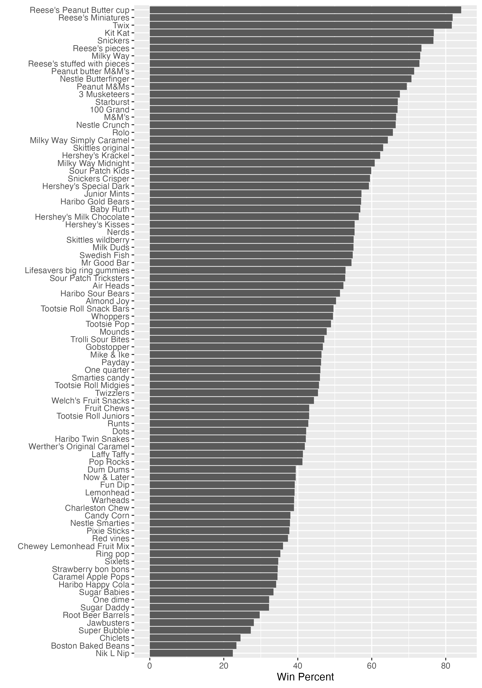

# class09:Halloween Mini-Project
Anna Waters (PID: A16271985)

Here we analyze a candy dataset form the 538 website. This is a CSV file
from their GitHub repository.

## Importing Data

``` r
candy_file <- "https://raw.githubusercontent.com/fivethirtyeight/data/master/candy-power-ranking/candy-data.csv"

candy = read.csv(candy_file, row.names=1)
head(candy)
```

                 chocolate fruity caramel peanutyalmondy nougat crispedricewafer
    100 Grand            1      0       1              0      0                1
    3 Musketeers         1      0       0              0      1                0
    One dime             0      0       0              0      0                0
    One quarter          0      0       0              0      0                0
    Air Heads            0      1       0              0      0                0
    Almond Joy           1      0       0              1      0                0
                 hard bar pluribus sugarpercent pricepercent winpercent
    100 Grand       0   1        0        0.732        0.860   66.97173
    3 Musketeers    0   1        0        0.604        0.511   67.60294
    One dime        0   0        0        0.011        0.116   32.26109
    One quarter     0   0        0        0.011        0.511   46.11650
    Air Heads       0   0        0        0.906        0.511   52.34146
    Almond Joy      0   1        0        0.465        0.767   50.34755

## Data Exploration

> Q1. How many different candy types are in this dataset?

``` r
nrow(candy)
```

    [1] 85

There are 85 different types of candy in this data set.

> Q2. How many fruity candy types are in the dataset?

``` r
sum(candy$fruity)
```

    [1] 38

There are 38 candies that are labeled as fruity in the data set.

## Whats your favorite Candy

> Q3. What is your favorite candy in the dataset and what is it’s
> winpercent value?

``` r
candy["Reese's Peanut Butter cup",]$winpercent
```

    [1] 84.18029

My favorate, Reese’s peanut butter cups have a win percentage of 84.18%.

> Q4. What is the winpercent value for “Kit Kat”?

``` r
candy["Kit Kat",]$winpercent
```

    [1] 76.7686

The win percent for kit kat is 76.76%

> Q5. What is the winpercent value for “Tootsie Roll Snack Bars”?

``` r
candy["Tootsie Roll Snack Bars",]$winpercent
```

    [1] 49.6535

The win percent for the tootsie roll is 49.65%.

> What is the least liked candy in the dataset - lowest winpercent?

``` r
inds <- order(candy$winpercent)
head(candy[inds,])
```

                       chocolate fruity caramel peanutyalmondy nougat
    Nik L Nip                  0      1       0              0      0
    Boston Baked Beans         0      0       0              1      0
    Chiclets                   0      1       0              0      0
    Super Bubble               0      1       0              0      0
    Jawbusters                 0      1       0              0      0
    Root Beer Barrels          0      0       0              0      0
                       crispedricewafer hard bar pluribus sugarpercent pricepercent
    Nik L Nip                         0    0   0        1        0.197        0.976
    Boston Baked Beans                0    0   0        1        0.313        0.511
    Chiclets                          0    0   0        1        0.046        0.325
    Super Bubble                      0    0   0        0        0.162        0.116
    Jawbusters                        0    1   0        1        0.093        0.511
    Root Beer Barrels                 0    1   0        1        0.732        0.069
                       winpercent
    Nik L Nip            22.44534
    Boston Baked Beans   23.41782
    Chiclets             24.52499
    Super Bubble         27.30386
    Jawbusters           28.12744
    Root Beer Barrels    29.70369

The least liked candy is the Nik L Nip with a win percent of 22.44%.

``` r
library("skimr")
skim(candy)
```

|                                                  |       |
|:-------------------------------------------------|:------|
| Name                                             | candy |
| Number of rows                                   | 85    |
| Number of columns                                | 12    |
| \_\_\_\_\_\_\_\_\_\_\_\_\_\_\_\_\_\_\_\_\_\_\_   |       |
| Column type frequency:                           |       |
| numeric                                          | 12    |
| \_\_\_\_\_\_\_\_\_\_\_\_\_\_\_\_\_\_\_\_\_\_\_\_ |       |
| Group variables                                  | None  |

Data summary

**Variable type: numeric**

| skim_variable    | n_missing | complete_rate |  mean |    sd |    p0 |   p25 |   p50 |   p75 |  p100 | hist  |
|:-----------------|----------:|--------------:|------:|------:|------:|------:|------:|------:|------:|:------|
| chocolate        |         0 |             1 |  0.44 |  0.50 |  0.00 |  0.00 |  0.00 |  1.00 |  1.00 | ▇▁▁▁▆ |
| fruity           |         0 |             1 |  0.45 |  0.50 |  0.00 |  0.00 |  0.00 |  1.00 |  1.00 | ▇▁▁▁▆ |
| caramel          |         0 |             1 |  0.16 |  0.37 |  0.00 |  0.00 |  0.00 |  0.00 |  1.00 | ▇▁▁▁▂ |
| peanutyalmondy   |         0 |             1 |  0.16 |  0.37 |  0.00 |  0.00 |  0.00 |  0.00 |  1.00 | ▇▁▁▁▂ |
| nougat           |         0 |             1 |  0.08 |  0.28 |  0.00 |  0.00 |  0.00 |  0.00 |  1.00 | ▇▁▁▁▁ |
| crispedricewafer |         0 |             1 |  0.08 |  0.28 |  0.00 |  0.00 |  0.00 |  0.00 |  1.00 | ▇▁▁▁▁ |
| hard             |         0 |             1 |  0.18 |  0.38 |  0.00 |  0.00 |  0.00 |  0.00 |  1.00 | ▇▁▁▁▂ |
| bar              |         0 |             1 |  0.25 |  0.43 |  0.00 |  0.00 |  0.00 |  0.00 |  1.00 | ▇▁▁▁▂ |
| pluribus         |         0 |             1 |  0.52 |  0.50 |  0.00 |  0.00 |  1.00 |  1.00 |  1.00 | ▇▁▁▁▇ |
| sugarpercent     |         0 |             1 |  0.48 |  0.28 |  0.01 |  0.22 |  0.47 |  0.73 |  0.99 | ▇▇▇▇▆ |
| pricepercent     |         0 |             1 |  0.47 |  0.29 |  0.01 |  0.26 |  0.47 |  0.65 |  0.98 | ▇▇▇▇▆ |
| winpercent       |         0 |             1 | 50.32 | 14.71 | 22.45 | 39.14 | 47.83 | 59.86 | 84.18 | ▃▇▆▅▂ |

> Q6. Is there any variable/column that looks to be on a different scale
> to the majority of the other columns in the dataset?

The winpercent column is not in the range of 0 to 1 unlike the other
columns.

> Q7. What do you think a zero and one represent for the
> candy\$chocolate column?

The 1 and 0 represents if the candy is chocolate(1) or not(0).

> Q8. Plot a histogram of winpercent values

``` r
hist(candy$winpercent)
```


> Q9. Is the distribution of winpercent values symmetrical?

No, the histogram is skewed.

> Q10. Is the center of the distribution above or below 50%?

The center of distribution is below 50%.

> Q11. On average is chocolate candy higher or lower ranked than fruit
> candy?

``` r
#using candy$winpercent to find all the winpercent values & taking the mean of those values
choco.mean <- mean(candy$winpercent[as.logical(candy$chocolate)])

fruity.mean <- mean(candy$winpercent[as.logical(candy$fruity)])

choco.mean
```

    [1] 60.92153

``` r
fruity.mean
```

    [1] 44.11974

On average, choclate candy has a higher ranking than fruity candies as
chocolate ranks at 60.9% and fruity at 44.1%.

> Q12. Is this difference statistically significant?

``` r
t.test(candy$winpercent[as.logical(candy$chocolate)],
       candy$winpercent[as.logical(candy$fruity)] )
```


        Welch Two Sample t-test

    data:  candy$winpercent[as.logical(candy$chocolate)] and candy$winpercent[as.logical(candy$fruity)]
    t = 6.2582, df = 68.882, p-value = 2.871e-08
    alternative hypothesis: true difference in means is not equal to 0
    95 percent confidence interval:
     11.44563 22.15795
    sample estimates:
    mean of x mean of y 
     60.92153  44.11974 

Yes, the p.value of the t-test is smaller than 0.05 which means the null
is rejected and the means are statistically significant.

## Overall Candy Rankings

> Q13. What are the five least liked candy types in this set?

``` r
inds <- order(candy$winpercent)
head(candy[inds,], n=5)
```

                       chocolate fruity caramel peanutyalmondy nougat
    Nik L Nip                  0      1       0              0      0
    Boston Baked Beans         0      0       0              1      0
    Chiclets                   0      1       0              0      0
    Super Bubble               0      1       0              0      0
    Jawbusters                 0      1       0              0      0
                       crispedricewafer hard bar pluribus sugarpercent pricepercent
    Nik L Nip                         0    0   0        1        0.197        0.976
    Boston Baked Beans                0    0   0        1        0.313        0.511
    Chiclets                          0    0   0        1        0.046        0.325
    Super Bubble                      0    0   0        0        0.162        0.116
    Jawbusters                        0    1   0        1        0.093        0.511
                       winpercent
    Nik L Nip            22.44534
    Boston Baked Beans   23.41782
    Chiclets             24.52499
    Super Bubble         27.30386
    Jawbusters           28.12744

The five least liked are Nik L Nip, Boston Baked Beans, Chiclets, Super
Bubble and Jawbusters.

> Q14. What are the top 5 all time favorite candy types out of this set?

``` r
head(candy[order(candy$winpercent,decreasing = T),], n=5)
```

                              chocolate fruity caramel peanutyalmondy nougat
    Reese's Peanut Butter cup         1      0       0              1      0
    Reese's Miniatures                1      0       0              1      0
    Twix                              1      0       1              0      0
    Kit Kat                           1      0       0              0      0
    Snickers                          1      0       1              1      1
                              crispedricewafer hard bar pluribus sugarpercent
    Reese's Peanut Butter cup                0    0   0        0        0.720
    Reese's Miniatures                       0    0   0        0        0.034
    Twix                                     1    0   1        0        0.546
    Kit Kat                                  1    0   1        0        0.313
    Snickers                                 0    0   1        0        0.546
                              pricepercent winpercent
    Reese's Peanut Butter cup        0.651   84.18029
    Reese's Miniatures               0.279   81.86626
    Twix                             0.906   81.64291
    Kit Kat                          0.511   76.76860
    Snickers                         0.651   76.67378

The top 5 most liked candies are Reese’s Peanut butter cups, reese’s
miniatures, Twix, Kit Kats and snickers.

> Q15. Make a first barplot of candy ranking based on winpercent values

``` r
library(ggplot2)

ggplot(candy, aes(x= winpercent, y= rownames(candy))) +
  geom_col()
```


> Q16. This is quite ugly, use the reorder() function to get the bars
> sorted by winpercent?

``` r
# `reorder` is changing the rowname order in accordance with the winpercent as it is the y argument 
ggplot(candy, aes(winpercent, reorder(rownames(candy),winpercent)))+
  geom_col() +
  labs(x="Win Percent", y= "")
```


``` r
#to fix the aspect ratio saving it can allow to manually set the ratio to the 7 by 10
ggsave('barplot1.png', width = 7, height = 10)
```

 You can insert any image
using the exclamation mark w/ square braket markdown syntax

Time for Color

We need a custom color vector to add color to our ggplot.

``` r
#setting the vector to be as long as all rows
my_cols <- rep("black", nrow(candy))
# using the as logical to assign true and false & assign chocolate color to the trues
my_cols[as.logical(candy$chocolate)] = "lightblue4"
my_cols[as.logical(candy$bar)] = "purple3"
my_cols[as.logical(candy$fruity)] = "orchid3"
```

``` r
ggplot(candy, aes(winpercent, reorder(rownames(candy),winpercent)))+
  geom_col(fill = my_cols) +
  labs(x="Win Percent", y= "")
```


> Q17. What is the worst ranked chocolate candy?

Sixlets are the worst ranked chocolate candy.

> Q18. What is the best ranked fruity candy?

Starburst are the best ranked fruity candy.

## Price Percent

``` r
candy$pricepercent
```

     [1] 0.860 0.511 0.116 0.511 0.511 0.767 0.767 0.511 0.325 0.325 0.511 0.511
    [13] 0.325 0.511 0.034 0.034 0.325 0.453 0.465 0.465 0.465 0.465 0.093 0.918
    [25] 0.918 0.918 0.511 0.511 0.511 0.116 0.104 0.279 0.651 0.651 0.325 0.511
    [37] 0.651 0.441 0.860 0.860 0.918 0.325 0.767 0.767 0.976 0.325 0.767 0.651
    [49] 0.023 0.837 0.116 0.279 0.651 0.651 0.651 0.965 0.860 0.069 0.279 0.081
    [61] 0.220 0.220 0.976 0.116 0.651 0.651 0.116 0.116 0.220 0.058 0.767 0.325
    [73] 0.116 0.755 0.325 0.511 0.011 0.325 0.255 0.906 0.116 0.116 0.313 0.267
    [85] 0.848

If we want to see what is a good candy to buy in terms of winpercent and
pricepercent, we can plot the two varaibles and then see the best candy
for the least amount of money.

``` r
ggplot(candy, aes(winpercent, pricepercent, label=rownames(candy))) +
  geom_point(col = my_cols) +
  geom_text()
```


To avoid the overplotting of all these labels, we can use an add on
package called ggrepl

``` r
library(ggrepel)

ggplot(candy, aes(winpercent, pricepercent, label=rownames(candy))) +
  geom_point(col = my_cols) +
  geom_text_repel()
```

    Warning: ggrepel: 29 unlabeled data points (too many overlaps). Consider
    increasing max.overlaps


Play with max.overlaps parameter in `geom_text_repel()`

``` r
ggplot(candy, aes(winpercent, pricepercent, label=rownames(candy))) +
  geom_point(col = my_cols) +
  geom_text_repel(max.overlaps = 5, col=my_cols)
```

    Warning: ggrepel: 57 unlabeled data points (too many overlaps). Consider
    increasing max.overlaps


> Q19. Which candy type is the highest ranked in terms of winpercent for
> the least money - i.e. offers the most bang for your buck?

``` r
ord <- order(candy$winpercent, decreasing = TRUE)
head( candy[ord,c(11,12)], n=5 )
```

                              pricepercent winpercent
    Reese's Peanut Butter cup        0.651   84.18029
    Reese's Miniatures               0.279   81.86626
    Twix                             0.906   81.64291
    Kit Kat                          0.511   76.76860
    Snickers                         0.651   76.67378

Reese’s minis have the second highest winrate of 81.86% with a
pricepercent of 0.279, making it the best ranked and most economical.

> Q20. What are the top 5 most expensive candy types in the dataset and
> of these which is the least popular?

``` r
ord_price <- order(candy$pricepercent, decreasing = TRUE)
head( candy[ord_price,c(11,12)], n=5 )
```

                             pricepercent winpercent
    Nik L Nip                       0.976   22.44534
    Nestle Smarties                 0.976   37.88719
    Ring pop                        0.965   35.29076
    Hershey's Krackel               0.918   62.28448
    Hershey's Milk Chocolate        0.918   56.49050

The top 5 are Nik L Nip, Nestle Smarties, Ring Pops, Hershey’s krackel,
Hershey’s milk chocolate with the least popular as Nik L Nip.

## 5 Exploring the correlation structure

``` r
library(corrplot)
```

    corrplot 0.92 loaded

``` r
cij <- cor(candy)
corrplot(cij)
```


> Q22. Examining this plot what two variables are anti-correlated
> (i.e. have minus values)?

Fruity and chocolate values are anti-correlated with each other since
the circle is large and dark red. It is unlikely that fruit and
chocolate are together.

> Q23. Similarly, what two variables are most positively correlated?

Other than a variable against itself, the winpercent and chocolate
variables are highly correlated with a large size and dark blue color.

## 6 PCA

``` r
pca <- prcomp(candy, scale=TRUE)
summary(pca)
```

    Importance of components:
                              PC1    PC2    PC3     PC4    PC5     PC6     PC7
    Standard deviation     2.0788 1.1378 1.1092 1.07533 0.9518 0.81923 0.81530
    Proportion of Variance 0.3601 0.1079 0.1025 0.09636 0.0755 0.05593 0.05539
    Cumulative Proportion  0.3601 0.4680 0.5705 0.66688 0.7424 0.79830 0.85369
                               PC8     PC9    PC10    PC11    PC12
    Standard deviation     0.74530 0.67824 0.62349 0.43974 0.39760
    Proportion of Variance 0.04629 0.03833 0.03239 0.01611 0.01317
    Cumulative Proportion  0.89998 0.93832 0.97071 0.98683 1.00000

``` r
plot(pca$x[,1:2])
```


``` r
plot(pca$x[,1:2], col=my_cols, pch=16)
```


``` r
# Make a new data-frame with our PCA results and candy data
my_data <- cbind(candy, pca$x[,1:3])
```

``` r
#set the size to show the win percentage
p <- ggplot(my_data) + 
        aes(x=PC1, y=PC2,
            size=winpercent/100,
            text=rownames(my_data),
            label=rownames(my_data)) +
        geom_point(col=my_cols)

p
```


``` r
p + geom_text_repel(size=3.3, col=my_cols, max.overlaps = 7)  + 
  theme(legend.position = "none") +
  labs(title="Halloween Candy PCA Space",
       subtitle="Colored by type: chocolate bar (dark purple), chocolate other (steel grey), fruity (pink), other (black)",
       caption="Data from 538")
```

    Warning: ggrepel: 39 unlabeled data points (too many overlaps). Consider
    increasing max.overlaps


\##loadings plot

``` r
loadings <- as.data.frame(pca$rotation)

ggplot(loadings, aes(PC1, reorder(rownames(loadings), PC1))) +
  geom_col()
```


> Q24. What original variables are picked up strongly by PC1 in the
> positive direction? Do these make sense to you?

Fruity, hard and pluribus variables are picked up in the positive PC1
direction. This makes sense because it echos what we found and what we
know about candy correlations. Fruity candies are more likely to come
with many like starburts or skittles and are more likely to be hard. It
also makes sense they are in the opposite direction of chocolate and
chocolate associated factors like nougat.
