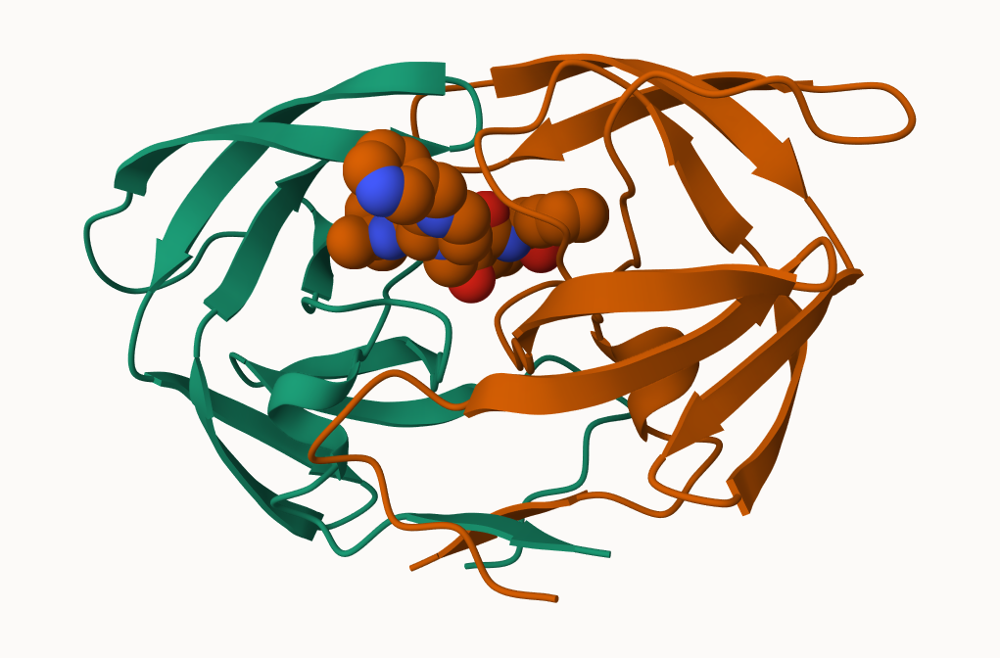

# class 10: Structural Bioinformatics (pt.1)
Anna Waters (PID: A16271985)

\##Section 1

Here we examine the size and composition of the main database of
biomolecular structures - the PDB.

Get a CSV file from the PDB databse and read it into R.

``` r
csv <- "Data Export Summary.csv"

pdbstats <- read.csv(csv, row.names = 1)
head(pdbstats)
```

                              X.ray     EM    NMR Multiple.methods Neutron Other
    Protein (only)          161,663 12,592 12,337              200      74    32
    Protein/Oligosaccharide   9,348  2,167     34                8       2     0
    Protein/NA                8,404  3,924    286                7       0     0
    Nucleic acid (only)       2,758    125  1,477               14       3     1
    Other                       164      9     33                0       0     0
    Oligosaccharide (only)       11      0      6                1       0     4
                              Total
    Protein (only)          186,898
    Protein/Oligosaccharide  11,559
    Protein/NA               12,621
    Nucleic acid (only)       4,378
    Other                       206
    Oligosaccharide (only)       22

> Q1: What percentage of structures in the PDB are solved by X-Ray and
> Electron Microscopy.

My PDB stats frame has commas in it, making them characters. This may
cause problems:

``` r
#sum(pdbstats$X.ray)
```

We found the function of `gsub()` now we can figure out how it works.

``` r
x <- "22,000"
as.numeric(gsub(",","",x))
```

    [1] 22000

I can turn this into a function that I can use for every column in the
table.

``` r
commasum <- function(x){
  sum(as.numeric(gsub(",","",x)))
}

commasum(pdbstats$X.ray)
```

    [1] 182348

Applying the function to all of the column using the `apply()` function.

``` r
totals <- apply(pdbstats, 2, commasum)
head(totals)
```

               X.ray               EM              NMR Multiple.methods 
              182348            18817            14173              230 
             Neutron            Other 
                  79               37 

``` r
round(totals/totals["Total"]*100,2)
```

               X.ray               EM              NMR Multiple.methods 
               84.54             8.72             6.57             0.11 
             Neutron            Other            Total 
                0.04             0.02           100.00 

84.54 are with X ray and 8.72% are due to EM.

> Q2: What proportion of structures in the PDB are protein?

``` r
round(as.numeric(gsub(",","",pdbstats[1,7]))/totals["Total"]*100,2)
```

    Total 
    86.65 

The proportion of PDB that are protein is 86.65%.

``` r
(215684/249751891 * 100)
```

    [1] 0.08635931

The amount of publicly available structures.

## Visualization

We will learn the basics of Mol\*. We will play with PDB code 1HSG

> Q4: Water molecules normally have 3 atoms. Why do we see just one atom
> per water molecule in this structure?

We only see one atom per water molecule because Hydrogen is so small
that it is not picked up by the resultion of the stick and ball.

> Q5: There is a critical “conserved” water molecule in the binding
> site. Can you identify this water molecule? What residue number does
> this water molecule have

The water molecule is HOH 308.




## Back to R and working with PDB

Predict the dynamics of

``` r
library(bio3d)

hiv <- read.pdb("1hsg")
```

      Note: Accessing on-line PDB file

``` r
hiv
```


     Call:  read.pdb(file = "1hsg")

       Total Models#: 1
         Total Atoms#: 1686,  XYZs#: 5058  Chains#: 2  (values: A B)

         Protein Atoms#: 1514  (residues/Calpha atoms#: 198)
         Nucleic acid Atoms#: 0  (residues/phosphate atoms#: 0)

         Non-protein/nucleic Atoms#: 172  (residues: 128)
         Non-protein/nucleic resid values: [ HOH (127), MK1 (1) ]

       Protein sequence:
          PQITLWQRPLVTIKIGGQLKEALLDTGADDTVLEEMSLPGRWKPKMIGGIGGFIKVRQYD
          QILIEICGHKAIGTVLVGPTPVNIIGRNLLTQIGCTLNFPQITLWQRPLVTIKIGGQLKE
          ALLDTGADDTVLEEMSLPGRWKPKMIGGIGGFIKVRQYDQILIEICGHKAIGTVLVGPTP
          VNIIGRNLLTQIGCTLNF

    + attr: atom, xyz, seqres, helix, sheet,
            calpha, remark, call

``` r
head(hiv$atom)
```

      type eleno elety  alt resid chain resno insert      x      y     z o     b
    1 ATOM     1     N <NA>   PRO     A     1   <NA> 29.361 39.686 5.862 1 38.10
    2 ATOM     2    CA <NA>   PRO     A     1   <NA> 30.307 38.663 5.319 1 40.62
    3 ATOM     3     C <NA>   PRO     A     1   <NA> 29.760 38.071 4.022 1 42.64
    4 ATOM     4     O <NA>   PRO     A     1   <NA> 28.600 38.302 3.676 1 43.40
    5 ATOM     5    CB <NA>   PRO     A     1   <NA> 30.508 37.541 6.342 1 37.87
    6 ATOM     6    CG <NA>   PRO     A     1   <NA> 29.296 37.591 7.162 1 38.40
      segid elesy charge
    1  <NA>     N   <NA>
    2  <NA>     C   <NA>
    3  <NA>     C   <NA>
    4  <NA>     O   <NA>
    5  <NA>     C   <NA>
    6  <NA>     C   <NA>

``` r
pdbseq(hiv)
```

      1   2   3   4   5   6   7   8   9  10  11  12  13  14  15  16  17  18  19  20 
    "P" "Q" "I" "T" "L" "W" "Q" "R" "P" "L" "V" "T" "I" "K" "I" "G" "G" "Q" "L" "K" 
     21  22  23  24  25  26  27  28  29  30  31  32  33  34  35  36  37  38  39  40 
    "E" "A" "L" "L" "D" "T" "G" "A" "D" "D" "T" "V" "L" "E" "E" "M" "S" "L" "P" "G" 
     41  42  43  44  45  46  47  48  49  50  51  52  53  54  55  56  57  58  59  60 
    "R" "W" "K" "P" "K" "M" "I" "G" "G" "I" "G" "G" "F" "I" "K" "V" "R" "Q" "Y" "D" 
     61  62  63  64  65  66  67  68  69  70  71  72  73  74  75  76  77  78  79  80 
    "Q" "I" "L" "I" "E" "I" "C" "G" "H" "K" "A" "I" "G" "T" "V" "L" "V" "G" "P" "T" 
     81  82  83  84  85  86  87  88  89  90  91  92  93  94  95  96  97  98  99   1 
    "P" "V" "N" "I" "I" "G" "R" "N" "L" "L" "T" "Q" "I" "G" "C" "T" "L" "N" "F" "P" 
      2   3   4   5   6   7   8   9  10  11  12  13  14  15  16  17  18  19  20  21 
    "Q" "I" "T" "L" "W" "Q" "R" "P" "L" "V" "T" "I" "K" "I" "G" "G" "Q" "L" "K" "E" 
     22  23  24  25  26  27  28  29  30  31  32  33  34  35  36  37  38  39  40  41 
    "A" "L" "L" "D" "T" "G" "A" "D" "D" "T" "V" "L" "E" "E" "M" "S" "L" "P" "G" "R" 
     42  43  44  45  46  47  48  49  50  51  52  53  54  55  56  57  58  59  60  61 
    "W" "K" "P" "K" "M" "I" "G" "G" "I" "G" "G" "F" "I" "K" "V" "R" "Q" "Y" "D" "Q" 
     62  63  64  65  66  67  68  69  70  71  72  73  74  75  76  77  78  79  80  81 
    "I" "L" "I" "E" "I" "C" "G" "H" "K" "A" "I" "G" "T" "V" "L" "V" "G" "P" "T" "P" 
     82  83  84  85  86  87  88  89  90  91  92  93  94  95  96  97  98  99 
    "V" "N" "I" "I" "G" "R" "N" "L" "L" "T" "Q" "I" "G" "C" "T" "L" "N" "F" 

Here we will do a Normal Model Analysis(NMA) to predict functional
motions of a kinase protein

``` r
adk <- read.pdb("6s36")
```

      Note: Accessing on-line PDB file
       PDB has ALT records, taking A only, rm.alt=TRUE

``` r
adk
```


     Call:  read.pdb(file = "6s36")

       Total Models#: 1
         Total Atoms#: 1898,  XYZs#: 5694  Chains#: 1  (values: A)

         Protein Atoms#: 1654  (residues/Calpha atoms#: 214)
         Nucleic acid Atoms#: 0  (residues/phosphate atoms#: 0)

         Non-protein/nucleic Atoms#: 244  (residues: 244)
         Non-protein/nucleic resid values: [ CL (3), HOH (238), MG (2), NA (1) ]

       Protein sequence:
          MRIILLGAPGAGKGTQAQFIMEKYGIPQISTGDMLRAAVKSGSELGKQAKDIMDAGKLVT
          DELVIALVKERIAQEDCRNGFLLDGFPRTIPQADAMKEAGINVDYVLEFDVPDELIVDKI
          VGRRVHAPSGRVYHVKFNPPKVEGKDDVTGEELTTRKDDQEETVRKRLVEYHQMTAPLIG
          YYSKEAEAGNTKYAKVDGTKPVAEVRADLEKILG

    + attr: atom, xyz, seqres, helix, sheet,
            calpha, remark, call

``` r
modes <- nma(adk)
```

     Building Hessian...        Done in 0.043 seconds.
     Diagonalizing Hessian...   Done in 0.491 seconds.

``` r
plot(modes)
```


Make a “movie” called a trajectory for off the predicted motions

``` r
mktrj(modes, file= "adk_m7.pdb")
```

Then I can open this file in Mol\*…
