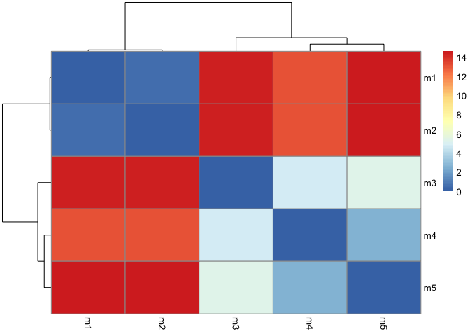
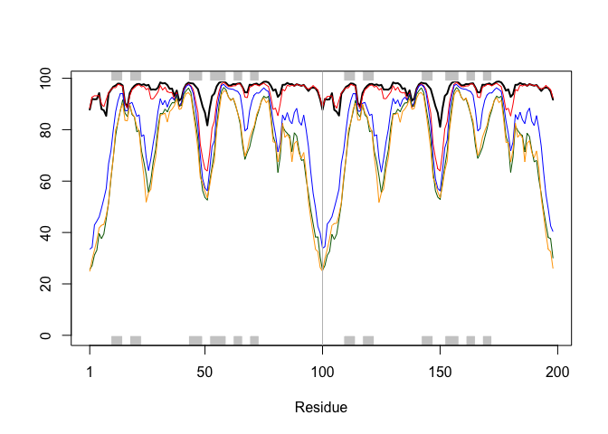
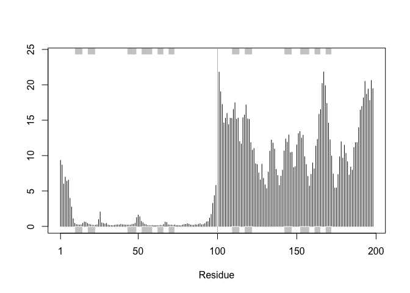
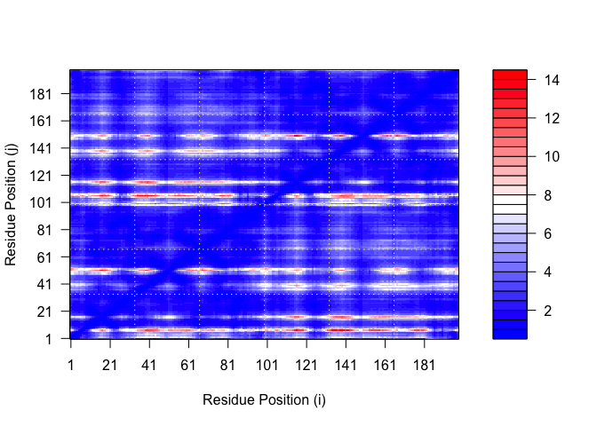
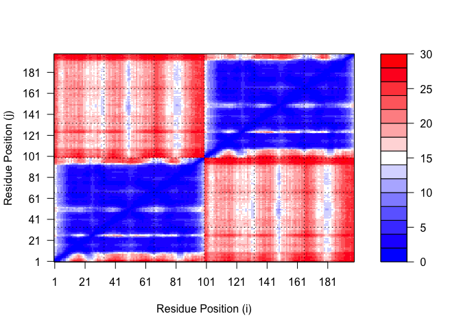
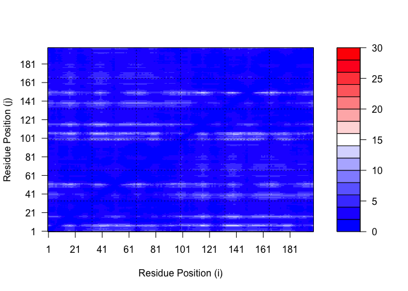
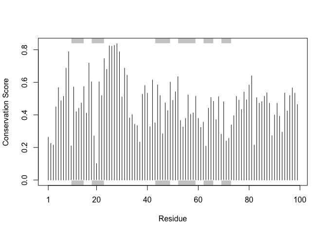

# class11: Structural Bioinformatics (pt 2)
Anna Waters (PID: A16271985)

Alphafold has changed the game for protein structure prediction and
allows anyone with sufficient bioinformatics skills to predict the
structure of virtually any protein.

We ran alphafold through GoogleColab at:
https://colab.research.google.com/github/sokrypton/ColabFold/blob/main/AlphaFold2.ipynb

Specifially, we used their Alphafold2_mmseqs2 version that uses mmseqs2
rather than HMMMer for sequence search.

The Main outputs include a set of **PDB files** along with matching
**.Json** format files that tell how good the resulting models might be.

Let’s start by loading these PDB structures up in Mol\*

``` r
library(bio3d)

# Change this for YOUR results dir name
results_dir <- "hivprdimer_23119/" 

# File names for all PDB models
pdb_files <- list.files(path=results_dir,
                        pattern="*.pdb",
                        full.names = TRUE)

# Print our PDB file names
basename(pdb_files)
```

    [1] "hivprdimer_23119_unrelaxed_rank_001_alphafold2_multimer_v3_model_1_seed_000.pdb"
    [2] "hivprdimer_23119_unrelaxed_rank_002_alphafold2_multimer_v3_model_5_seed_000.pdb"
    [3] "hivprdimer_23119_unrelaxed_rank_003_alphafold2_multimer_v3_model_4_seed_000.pdb"
    [4] "hivprdimer_23119_unrelaxed_rank_004_alphafold2_multimer_v3_model_2_seed_000.pdb"
    [5] "hivprdimer_23119_unrelaxed_rank_005_alphafold2_multimer_v3_model_3_seed_000.pdb"

Alignment of

``` r
# Read all data from Models 
#  and superpose/fit coords
pdbs <- pdbaln(pdb_files, fit=TRUE, exefile="msa")
```

    Reading PDB files:
    hivprdimer_23119//hivprdimer_23119_unrelaxed_rank_001_alphafold2_multimer_v3_model_1_seed_000.pdb
    hivprdimer_23119//hivprdimer_23119_unrelaxed_rank_002_alphafold2_multimer_v3_model_5_seed_000.pdb
    hivprdimer_23119//hivprdimer_23119_unrelaxed_rank_003_alphafold2_multimer_v3_model_4_seed_000.pdb
    hivprdimer_23119//hivprdimer_23119_unrelaxed_rank_004_alphafold2_multimer_v3_model_2_seed_000.pdb
    hivprdimer_23119//hivprdimer_23119_unrelaxed_rank_005_alphafold2_multimer_v3_model_3_seed_000.pdb
    .....

    Extracting sequences

    pdb/seq: 1   name: hivprdimer_23119//hivprdimer_23119_unrelaxed_rank_001_alphafold2_multimer_v3_model_1_seed_000.pdb 
    pdb/seq: 2   name: hivprdimer_23119//hivprdimer_23119_unrelaxed_rank_002_alphafold2_multimer_v3_model_5_seed_000.pdb 
    pdb/seq: 3   name: hivprdimer_23119//hivprdimer_23119_unrelaxed_rank_003_alphafold2_multimer_v3_model_4_seed_000.pdb 
    pdb/seq: 4   name: hivprdimer_23119//hivprdimer_23119_unrelaxed_rank_004_alphafold2_multimer_v3_model_2_seed_000.pdb 
    pdb/seq: 5   name: hivprdimer_23119//hivprdimer_23119_unrelaxed_rank_005_alphafold2_multimer_v3_model_3_seed_000.pdb 

``` r
pdbs
```

                                   1        .         .         .         .         50 
    [Truncated_Name:1]hivprdimer   PQITLWQRPLVTIKIGGQLKEALLDTGADDTVLEEMSLPGRWKPKMIGGI
    [Truncated_Name:2]hivprdimer   PQITLWQRPLVTIKIGGQLKEALLDTGADDTVLEEMSLPGRWKPKMIGGI
    [Truncated_Name:3]hivprdimer   PQITLWQRPLVTIKIGGQLKEALLDTGADDTVLEEMSLPGRWKPKMIGGI
    [Truncated_Name:4]hivprdimer   PQITLWQRPLVTIKIGGQLKEALLDTGADDTVLEEMSLPGRWKPKMIGGI
    [Truncated_Name:5]hivprdimer   PQITLWQRPLVTIKIGGQLKEALLDTGADDTVLEEMSLPGRWKPKMIGGI
                                   ************************************************** 
                                   1        .         .         .         .         50 

                                  51        .         .         .         .         100 
    [Truncated_Name:1]hivprdimer   GGFIKVRQYDQILIEICGHKAIGTVLVGPTPVNIIGRNLLTQIGCTLNFP
    [Truncated_Name:2]hivprdimer   GGFIKVRQYDQILIEICGHKAIGTVLVGPTPVNIIGRNLLTQIGCTLNFP
    [Truncated_Name:3]hivprdimer   GGFIKVRQYDQILIEICGHKAIGTVLVGPTPVNIIGRNLLTQIGCTLNFP
    [Truncated_Name:4]hivprdimer   GGFIKVRQYDQILIEICGHKAIGTVLVGPTPVNIIGRNLLTQIGCTLNFP
    [Truncated_Name:5]hivprdimer   GGFIKVRQYDQILIEICGHKAIGTVLVGPTPVNIIGRNLLTQIGCTLNFP
                                   ************************************************** 
                                  51        .         .         .         .         100 

                                 101        .         .         .         .         150 
    [Truncated_Name:1]hivprdimer   QITLWQRPLVTIKIGGQLKEALLDTGADDTVLEEMSLPGRWKPKMIGGIG
    [Truncated_Name:2]hivprdimer   QITLWQRPLVTIKIGGQLKEALLDTGADDTVLEEMSLPGRWKPKMIGGIG
    [Truncated_Name:3]hivprdimer   QITLWQRPLVTIKIGGQLKEALLDTGADDTVLEEMSLPGRWKPKMIGGIG
    [Truncated_Name:4]hivprdimer   QITLWQRPLVTIKIGGQLKEALLDTGADDTVLEEMSLPGRWKPKMIGGIG
    [Truncated_Name:5]hivprdimer   QITLWQRPLVTIKIGGQLKEALLDTGADDTVLEEMSLPGRWKPKMIGGIG
                                   ************************************************** 
                                 101        .         .         .         .         150 

                                 151        .         .         .         .       198 
    [Truncated_Name:1]hivprdimer   GFIKVRQYDQILIEICGHKAIGTVLVGPTPVNIIGRNLLTQIGCTLNF
    [Truncated_Name:2]hivprdimer   GFIKVRQYDQILIEICGHKAIGTVLVGPTPVNIIGRNLLTQIGCTLNF
    [Truncated_Name:3]hivprdimer   GFIKVRQYDQILIEICGHKAIGTVLVGPTPVNIIGRNLLTQIGCTLNF
    [Truncated_Name:4]hivprdimer   GFIKVRQYDQILIEICGHKAIGTVLVGPTPVNIIGRNLLTQIGCTLNF
    [Truncated_Name:5]hivprdimer   GFIKVRQYDQILIEICGHKAIGTVLVGPTPVNIIGRNLLTQIGCTLNF
                                   ************************************************ 
                                 151        .         .         .         .       198 

    Call:
      pdbaln(files = pdb_files, fit = TRUE, exefile = "msa")

    Class:
      pdbs, fasta

    Alignment dimensions:
      5 sequence rows; 198 position columns (198 non-gap, 0 gap) 

    + attr: xyz, resno, b, chain, id, ali, resid, sse, call

Using RMSD to calculate the closeness between the different models but
computing the root mean squared deviation between the amino acids. RMSD
is a standard measure of structural distance between coordinate sets. We
can use the rmsd() function to calculate the RMSD between all pairs
models.

``` r
#root mean squared deviation
rd <- rmsd(pdbs, fit=T)
```

    Warning in rmsd(pdbs, fit = T): No indices provided, using the 198 non NA positions

``` r
range(rd)
```

    [1]  0.000 14.631

Heat map of the RMSD results.

``` r
library(pheatmap)

colnames(rd) <- paste0("m",1:5)
rownames(rd) <- paste0("m",1:5)
pheatmap(rd)
```



Models 1&2 are the closest to each other while 3 through 5 are more
similar to themselves.

``` r
# Read a reference PDB structure
pdb <- read.pdb("1hsg")
```

      Note: Accessing on-line PDB file

This plots the b factor column and compares the b factors. The b factors
is the alpha fold confidence scores.

``` r
plotb3(pdbs$b[1,], typ="l", lwd=2, sse=pdb)
points(pdbs$b[2,], typ="l", col="red")
points(pdbs$b[3,], typ="l", col="blue")
points(pdbs$b[4,], typ="l", col="darkgreen")
points(pdbs$b[5,], typ="l", col="orange")
abline(v=100, col="gray")
```



Looking at this graph, once again models 1 and 2 are the most close
together and have the highest confidence (pLDDT) values in comparison to
the other 3 models.

We can improve the superposition/fitting of our models by finding the
most consistent “rigid core”.

``` r
core <- core.find(pdbs)
```

     core size 197 of 198  vol = 4578.352 
     core size 196 of 198  vol = 3931.113 
     core size 195 of 198  vol = 3709.737 
     core size 194 of 198  vol = 3496.023 
     core size 193 of 198  vol = 3302.436 
     core size 192 of 198  vol = 3146.478 
     core size 191 of 198  vol = 3048.969 
     core size 190 of 198  vol = 2970.358 
     core size 189 of 198  vol = 2893.016 
     core size 188 of 198  vol = 2831.829 
     core size 187 of 198  vol = 2774.51 
     core size 186 of 198  vol = 2728.049 
     core size 185 of 198  vol = 2704.953 
     core size 184 of 198  vol = 2701.988 
     core size 183 of 198  vol = 2715.915 
     core size 182 of 198  vol = 2809.862 
     core size 181 of 198  vol = 2888.961 
     core size 180 of 198  vol = 2967.296 
     core size 179 of 198  vol = 3036.25 
     core size 178 of 198  vol = 3066.28 
     core size 177 of 198  vol = 3096.829 
     core size 176 of 198  vol = 3056.412 
     core size 175 of 198  vol = 3014.767 
     core size 174 of 198  vol = 2975.012 
     core size 173 of 198  vol = 2898.05 
     core size 172 of 198  vol = 2810.173 
     core size 171 of 198  vol = 2747.532 
     core size 170 of 198  vol = 2684.434 
     core size 169 of 198  vol = 2620.353 
     core size 168 of 198  vol = 2550.877 
     core size 167 of 198  vol = 2492.582 
     core size 166 of 198  vol = 2422.978 
     core size 165 of 198  vol = 2358.916 
     core size 164 of 198  vol = 2298.292 
     core size 163 of 198  vol = 2235.918 
     core size 162 of 198  vol = 2171.02 
     core size 161 of 198  vol = 2093.559 
     core size 160 of 198  vol = 2029.144 
     core size 159 of 198  vol = 1950.957 
     core size 158 of 198  vol = 1881.015 
     core size 157 of 198  vol = 1801.506 
     core size 156 of 198  vol = 1728.892 
     core size 155 of 198  vol = 1660.037 
     core size 154 of 198  vol = 1586.149 
     core size 153 of 198  vol = 1532.718 
     core size 152 of 198  vol = 1460.186 
     core size 151 of 198  vol = 1399.251 
     core size 150 of 198  vol = 1333.908 
     core size 149 of 198  vol = 1271.747 
     core size 148 of 198  vol = 1219.496 
     core size 147 of 198  vol = 1176.003 
     core size 146 of 198  vol = 1138.478 
     core size 145 of 198  vol = 1102.124 
     core size 144 of 198  vol = 1049.642 
     core size 143 of 198  vol = 1014.063 
     core size 142 of 198  vol = 970.575 
     core size 141 of 198  vol = 929.178 
     core size 140 of 198  vol = 889.104 
     core size 139 of 198  vol = 846.668 
     core size 138 of 198  vol = 805.8 
     core size 137 of 198  vol = 775.034 
     core size 136 of 198  vol = 743.09 
     core size 135 of 198  vol = 715.695 
     core size 134 of 198  vol = 689.788 
     core size 133 of 198  vol = 660.329 
     core size 132 of 198  vol = 630.966 
     core size 131 of 198  vol = 597.207 
     core size 130 of 198  vol = 566.989 
     core size 129 of 198  vol = 532.89 
     core size 128 of 198  vol = 496.208 
     core size 127 of 198  vol = 463.183 
     core size 126 of 198  vol = 431.893 
     core size 125 of 198  vol = 408.864 
     core size 124 of 198  vol = 376.61 
     core size 123 of 198  vol = 362.377 
     core size 122 of 198  vol = 353.633 
     core size 121 of 198  vol = 331.501 
     core size 120 of 198  vol = 312.518 
     core size 119 of 198  vol = 286.715 
     core size 118 of 198  vol = 262.336 
     core size 117 of 198  vol = 245.109 
     core size 116 of 198  vol = 228.342 
     core size 115 of 198  vol = 210.366 
     core size 114 of 198  vol = 197.519 
     core size 113 of 198  vol = 179.392 
     core size 112 of 198  vol = 161.891 
     core size 111 of 198  vol = 148.359 
     core size 110 of 198  vol = 134.477 
     core size 109 of 198  vol = 121.261 
     core size 108 of 198  vol = 109.516 
     core size 107 of 198  vol = 103.031 
     core size 106 of 198  vol = 96.443 
     core size 105 of 198  vol = 88.455 
     core size 104 of 198  vol = 81.816 
     core size 103 of 198  vol = 74.88 
     core size 102 of 198  vol = 68.386 
     core size 101 of 198  vol = 65.937 
     core size 100 of 198  vol = 62.345 
     core size 99 of 198  vol = 58.836 
     core size 98 of 198  vol = 52.868 
     core size 97 of 198  vol = 47.796 
     core size 96 of 198  vol = 41.292 
     core size 95 of 198  vol = 33.831 
     core size 94 of 198  vol = 24.912 
     core size 93 of 198  vol = 18.912 
     core size 92 of 198  vol = 12.7 
     core size 91 of 198  vol = 7.35 
     core size 90 of 198  vol = 4.922 
     core size 89 of 198  vol = 3.421 
     core size 88 of 198  vol = 2.553 
     core size 87 of 198  vol = 1.917 
     core size 86 of 198  vol = 1.513 
     core size 85 of 198  vol = 1.201 
     core size 84 of 198  vol = 1.046 
     core size 83 of 198  vol = 0.922 
     core size 82 of 198  vol = 0.755 
     core size 81 of 198  vol = 0.668 
     core size 80 of 198  vol = 0.596 
     core size 79 of 198  vol = 0.549 
     core size 78 of 198  vol = 0.493 
     FINISHED: Min vol ( 0.5 ) reached

``` r
core.inds <- print(core, vol=0.5)
```

    # 79 positions (cumulative volume <= 0.5 Angstrom^3) 
      start end length
    1    10  25     16
    2    28  48     21
    3    53  94     42

Overlaying all of the pdbs according to their core structures. This can
be put into Mol\* to see what areas are conserved and where is there
heavy differences between the models.

``` r
xyz <- pdbfit(pdbs, core.inds, outpath="corefit_structures")
```

This RMSF calculation shows that there is high levels of variance the
second half of the structure.

``` r
rf <- rmsf(xyz)

plotb3(rf, sse=pdb)
abline(v=100, col="gray", ylab="RMSF")
```



If the predicted model has more than one domain, each domain may have
high confidence, yet the relative positions of the domains may not.The
estimated reliability of relative domain positions in graphics of
predicted aligned error (PAE) which are included in the downloadable zip
file and analyzed in R above.

\##Predicted ALignment Error for Domains Read in JSON files

``` r
library(jsonlite)

# Listing of all PAE JSON files
pae_files <- list.files(path=results_dir,
                        pattern=".*model.*\\.json",
                        full.names = TRUE)
```

``` r
pae1 <- read_json(pae_files[1],simplifyVector = TRUE)
pae2 <- read_json(pae_files[2],simplifyVector = TRUE)
pae3 <- read_json(pae_files[3],simplifyVector = TRUE)
pae4 <- read_json(pae_files[4],simplifyVector = TRUE)
pae5 <- read_json(pae_files[5],simplifyVector = TRUE)

attributes(pae1)
```

    $names
    [1] "plddt"   "max_pae" "pae"     "ptm"     "iptm"   

``` r
# Per-residue pLDDT scores 
#  same as B-factor of PDB..
head(pae1$plddt) 
```

    [1] 87.81 92.00 91.81 91.88 94.25 88.00

The maximum PAE values are useful for ranking models. Here we can see
that model 5 is much worse than model 1. The lower the PAE score the
better. How about the other models, what are thir max PAE scores?

``` r
pae1$max_pae
```

    [1] 14.09375

``` r
pae5$max_pae
```

    [1] 29.29688

``` r
pae3$max_pae
```

    [1] 28.5

``` r
pae2$max_pae
```

    [1] 16.35938

``` r
pae4$max_pae
```

    [1] 28.95312

Model 1 (14.09) is better than the rest of the models because it has the
lowest max, followed by model 2 (16.36).

We can plot the N by N (where N is the number of residues) PAE scores
with ggplot or with functions from the Bio3D package:

``` r
plot.dmat(pae1$pae, 
          xlab="Residue Position (i)",
          ylab="Residue Position (j)")
```



``` r
plot.dmat(pae5$pae, 
          xlab="Residue Position (i)",
          ylab="Residue Position (j)",
          grid.col = "black",
          zlim=c(0,30))
```



Model 1 replotted on the same scale as model 5 for better comparison.

``` r
plot.dmat(pae1$pae, 
          xlab="Residue Position (i)",
          ylab="Residue Position (j)",
          grid.col = "black",
          zlim=c(0,30))
```



\##Residue Conservation from alignment file

``` r
aln_file <- list.files(path=results_dir,
                       pattern=".a3m$",
                        full.names = TRUE)
aln_file
```

    [1] "hivprdimer_23119//hivprdimer_23119.a3m"

``` r
aln <- read.fasta(aln_file[1], to.upper = TRUE)
```

    [1] " ** Duplicated sequence id's: 101 **"
    [2] " ** Duplicated sequence id's: 101 **"

How many sequences are in this alignment

``` r
dim(aln$ali)
```

    [1] 5378  132

There are 5,378 sequences being aligned.

We can score residue conservation in the alignment with the conserv()
function.

``` r
sim <- conserv(aln)
```

``` r
plotb3(sim[1:99], sse=trim.pdb(pdb, chain="A"),
       ylab="Conservation Score")
```



Note the conserved Active Site residues D25, T26, G27, A28. These
positions will stand out if we generate a consensus sequence with a high
cutoff value:

``` r
con <- consensus(aln, cutoff = 0.9)
con$seq
```

      [1] "-" "-" "-" "-" "-" "-" "-" "-" "-" "-" "-" "-" "-" "-" "-" "-" "-" "-"
     [19] "-" "-" "-" "-" "-" "-" "D" "T" "G" "A" "-" "-" "-" "-" "-" "-" "-" "-"
     [37] "-" "-" "-" "-" "-" "-" "-" "-" "-" "-" "-" "-" "-" "-" "-" "-" "-" "-"
     [55] "-" "-" "-" "-" "-" "-" "-" "-" "-" "-" "-" "-" "-" "-" "-" "-" "-" "-"
     [73] "-" "-" "-" "-" "-" "-" "-" "-" "-" "-" "-" "-" "-" "-" "-" "-" "-" "-"
     [91] "-" "-" "-" "-" "-" "-" "-" "-" "-" "-" "-" "-" "-" "-" "-" "-" "-" "-"
    [109] "-" "-" "-" "-" "-" "-" "-" "-" "-" "-" "-" "-" "-" "-" "-" "-" "-" "-"
    [127] "-" "-" "-" "-" "-" "-"

For a final visualization of these functionally important sites we can
map this conservation score to the Occupancy column of a PDB file for
viewing in molecular viewer programs such as Mol\*, PyMol, VMD, chimera
etc.

``` r
m1.pdb <- read.pdb(pdb_files[1])
occ <- vec2resno(c(sim[1:99], sim[1:99]), m1.pdb$atom$resno)
write.pdb(m1.pdb, o=occ, file="m1_conserv.pdb")
```

Model 1 looks very, very good looking at all of these previous metrics.
