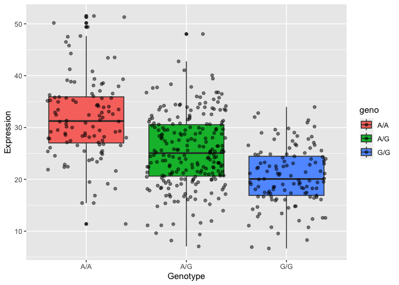

# Class12HW: Population Scale Analysis
Anna Waters (PID: A16271985)

> Q13: Read this file into R and determine the sample size for each
> genotype and their corresponding median expression levels for each of
> these genotypes.

Read in population scale data using `read.table()`. I used this because
the data was in a .txt file and seperated by a space rather than a
comma. This meant I had to set the sep argument to ““.

``` r
data <- "https://bioboot.github.io/bimm143_W24/class-material/rs8067378_ENSG00000172057.6.txt"

pop <- read.table(data, sep = "")
```

To determine the sample sizes for each genotype, I used the `summary()`
function to tally up how many of the samples were equal to the specific
genotype using the == logic argument.

``` r
# Summary function will add up all of the samples that have the genotype specified. 

summary(pop$geno == "A/G")
```

       Mode   FALSE    TRUE 
    logical     229     233 

``` r
summary(pop$geno == "A/A")
```

       Mode   FALSE    TRUE 
    logical     354     108 

``` r
summary(pop$geno == "G/G")
```

       Mode   FALSE    TRUE 
    logical     341     121 

The sample size for A/G is 233, for A/A is 108 and for G/G is 121
people.

To find the median of each genotype I used grouped the data by what
genotype is was through the `dplyr` group by function and the equals
logical. Then I used the `summarize()` function to find the median of
the genotype. I did this for each genotype.

``` r
library(dplyr)
```


    Attaching package: 'dplyr'

    The following objects are masked from 'package:stats':

        filter, lag

    The following objects are masked from 'package:base':

        intersect, setdiff, setequal, union

``` r
pop %>%
  group_by( geno == "A/A") %>%
  summarize(Median = median(exp))
```

    # A tibble: 2 × 2
      `geno == "A/A"` Median
      <lgl>            <dbl>
    1 FALSE             23.2
    2 TRUE              31.2

``` r
pop %>%
  group_by( geno == "A/G") %>%
  summarize(Median = median(exp))
```

    # A tibble: 2 × 2
      `geno == "A/G"` Median
      <lgl>            <dbl>
    1 FALSE             25.1
    2 TRUE              25.1

``` r
pop %>%
  group_by( geno == "G/G") %>%
  summarize(Median = median(exp))
```

    # A tibble: 2 × 2
      `geno == "G/G"` Median
      <lgl>            <dbl>
    1 FALSE             27.4
    2 TRUE              20.1

The median for A/A is 31.24, for A/G is 25.06 and for G/G is 20.07.

> Q14: Generate a boxplot with a box per genotype, what could you infer
> from the relative expression value between A/A and G/G displayed in
> this plot? Does the SNP effect the expression of ORMDL3?

I made a boxplot using `ggplot()` with the `geom_boxplot()` geom. I used
geno as the `fill` aesthetic so the data would be seperated by the three
genotypes to compare the expression data for the gene.

``` r
library(ggplot2)
ggplot(pop, aes(x= geno, y= exp, fill= geno)) +
  geom_boxplot() +
  geom_jitter(alpha= 0.5) +
  xlab("Genotype") +
  ylab("Expression")
```



Looking at this boxplot, it is clear that G/G genotype has a much lower
expression of ORMDL3 compared to the A/A genotype. While causation can’t
be assumed just from this, there seems to be a correlation between
expression levels and genotype where those with the G allele have a
lower expression of the gene.
