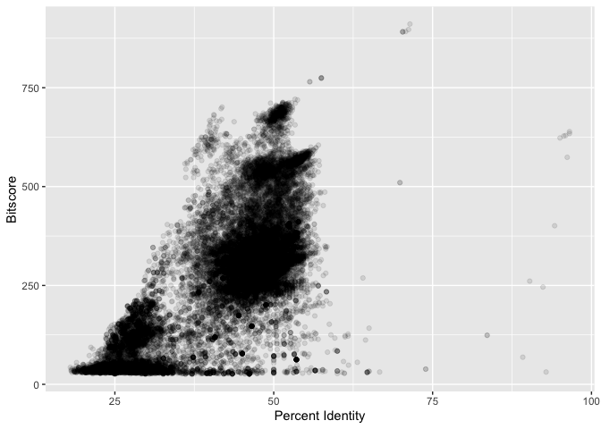

# class16:graphing the tsv
Anna Waters (PID: A16271985)

Reading in file from virtual computer

``` r
data <- read.delim("mm-second.x.zebrafish.tsv", sep = "\t")
```

Renaming columns

``` r
colnames(data) <- c("qseqid", "sseqid", "pident", "length", "mismatch", "gapopen", "qstart", "qend", "sstart", "send", "evalue", "bitscore")
head(data)
```

           qseqid         sseqid pident length mismatch gapopen qstart qend sstart
    1 NP_598866.1 NP_001313634.1 46.154    273      130       6      4  267    476
    2 NP_598866.1 XP_009294513.1 46.154    273      130       6      4  267    475
    3 NP_598866.1 NP_001186666.1 33.071    127       76       5      4  126    338
    4 NP_598866.1 NP_001003517.1 30.400    125       82       4      4  126    344
    5 NP_598866.1 NP_001003517.1 30.645     62       41       2     53  113     43
    6 NP_598866.1    NP_956073.2 34.444     90       56       3     40  126    527
      send   evalue bitscore
    1  740 4.51e-63    214.0
    2  739 4.69e-63    214.0
    3  459 5.19e-12     67.8
    4  465 2.67e-11     65.5
    5  103 4.40e-01     33.9
    6  616 1.70e-10     63.2

``` r
hist(data$bitscore, breaks = 30)
```


The data is not very normal, it is somewhat skewed towards lower
bitscores. There are peaks around 250 and 50 making it somewhat
binomial.

Making the tsv file plots

``` r
library(ggplot2)
ggplot(data, aes(pident, bitscore)) + geom_point(alpha=0.1) +
  xlab("Percent Identity") +
  ylab("Bitscore")
```



Looks like percent identiy and bitscore are not completely correlated
with each other.

``` r
ggplot(data, aes((data$pident * (data$qend - data$qstart)), bitscore)) + geom_point(alpha=0.1) + geom_smooth() +
  xlab("Percent Identity x Length") +
  ylab("Bitscore")
```

    Warning: Use of `data$pident` is discouraged.
    ℹ Use `pident` instead.

    Warning: Use of `data$qend` is discouraged.
    ℹ Use `qend` instead.

    Warning: Use of `data$qstart` is discouraged.
    ℹ Use `qstart` instead.

    Warning: Use of `data$pident` is discouraged.
    ℹ Use `pident` instead.

    Warning: Use of `data$qend` is discouraged.
    ℹ Use `qend` instead.

    Warning: Use of `data$qstart` is discouraged.
    ℹ Use `qstart` instead.

    `geom_smooth()` using method = 'gam' and formula = 'y ~ s(x, bs = "cs")'


This graph shows that the correlation between the percent identity and
sequence length with the bitscores is very high and positive.
