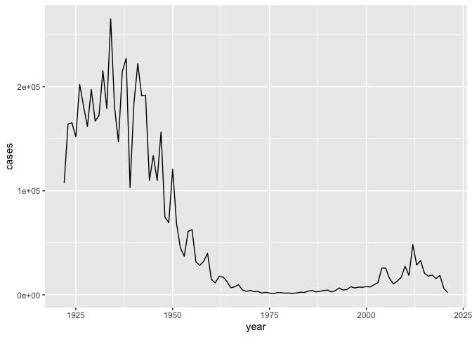
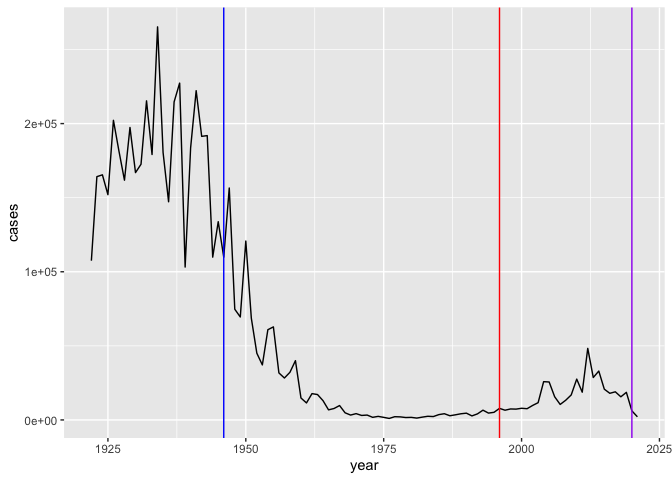
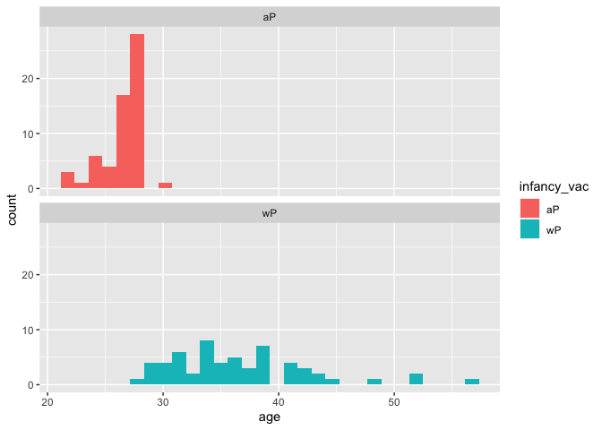
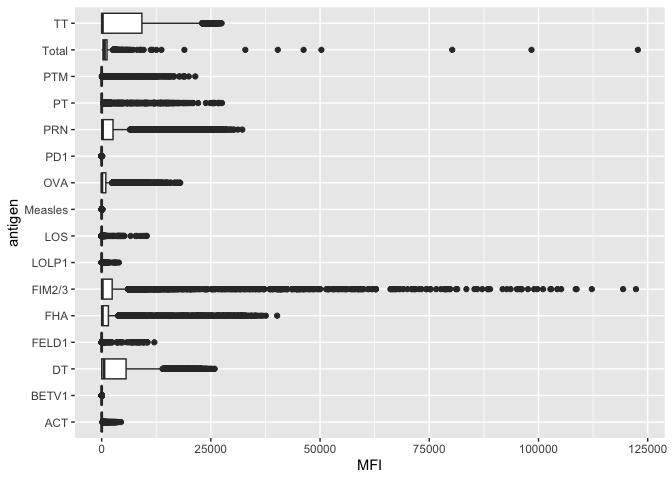
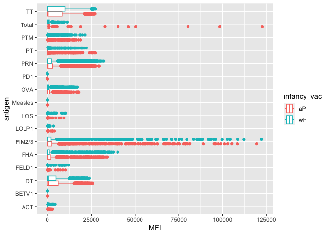
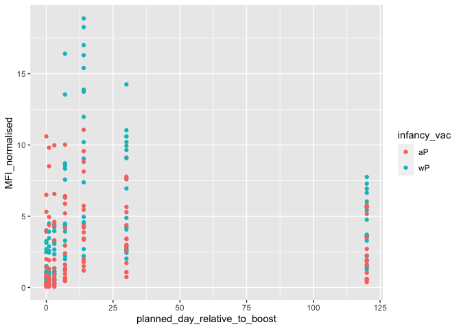
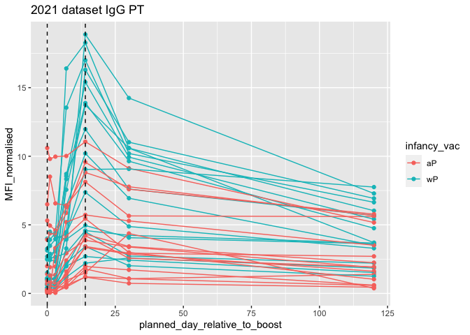

# Class 18: Pertussis mini-project
Anna Waters (PID: A16271985)

First we will examine and explore Pertussis case numbers in the US as
tracked by the
CDC:https://www.cdc.gov/pertussis/surv-reporting/cases-by-year.html

We can use the datapasta package to scrape this data from the website
into R:

``` r
cdc <- data.frame(
                                 year = c(1922L,1923L,1924L,1925L,
                                          1926L,1927L,1928L,1929L,1930L,1931L,
                                          1932L,1933L,1934L,1935L,1936L,
                                          1937L,1938L,1939L,1940L,1941L,1942L,
                                          1943L,1944L,1945L,1946L,1947L,
                                          1948L,1949L,1950L,1951L,1952L,
                                          1953L,1954L,1955L,1956L,1957L,1958L,
                                          1959L,1960L,1961L,1962L,1963L,
                                          1964L,1965L,1966L,1967L,1968L,1969L,
                                          1970L,1971L,1972L,1973L,1974L,
                                          1975L,1976L,1977L,1978L,1979L,1980L,
                                          1981L,1982L,1983L,1984L,1985L,
                                          1986L,1987L,1988L,1989L,1990L,
                                          1991L,1992L,1993L,1994L,1995L,1996L,
                                          1997L,1998L,1999L,2000L,2001L,
                                          2002L,2003L,2004L,2005L,2006L,2007L,
                                          2008L,2009L,2010L,2011L,2012L,
                                          2013L,2014L,2015L,2016L,2017L,2018L,
                                          2019L,2020L,2021L),
         cases = c(107473,164191,165418,152003,
                                          202210,181411,161799,197371,
                                          166914,172559,215343,179135,265269,
                                          180518,147237,214652,227319,103188,
                                          183866,222202,191383,191890,109873,
                                          133792,109860,156517,74715,69479,
                                          120718,68687,45030,37129,60886,
                                          62786,31732,28295,32148,40005,
                                          14809,11468,17749,17135,13005,6799,
                                          7717,9718,4810,3285,4249,3036,
                                          3287,1759,2402,1738,1010,2177,2063,
                                          1623,1730,1248,1895,2463,2276,
                                          3589,4195,2823,3450,4157,4570,
                                          2719,4083,6586,4617,5137,7796,6564,
                                          7405,7298,7867,7580,9771,11647,
                                          25827,25616,15632,10454,13278,
                                          16858,27550,18719,48277,28639,32971,
                                          20762,17972,18975,15609,18617,
                                          6124,2116)
       )
```

> Q1. With the help of the R “addin” package datapasta assign the CDC
> pertussis case number data to a data frame called cdc and use ggplot
> to make a plot of cases numbers over time.

I want a plot of cases per year:

``` r
library(ggplot2)

ggplot(cdc, aes(year, cases)) +
  geom_line()
```



> Q2. Using the ggplot geom_vline() function add lines to your previous
> plot for the 1946 introduction of the wP vaccine and the 1996 switch
> to aP vaccine (see example in the hint below). What do you notice?

``` r
ggplot(cdc, aes(year, cases)) +
  geom_line() +
  geom_vline(xintercept = 1946, col= "blue") +
  geom_vline(xintercept = 1996, col = "red") +
  geom_vline(xintercept = 2020, col= "purple")
```



> Q3. Describe what happened after the introduction of the aP vaccine?
> Do you have a possible explanation for the observed trend?

After the aP vaccine for about 10 years, case numbers were low and
stable, then there was a large increase in cases until 2020. 2020 and
onwards, there was a dramatic decrease in the number of cases.

Access data from the CMI-PB project:

This database (like many modern projects) uses an API to return JSON
format data.

We will use the R package `jsonlite`.

``` r
library(jsonlite)

subject <- read_json("http://cmi-pb.org/api/subject", simplifyVector = T)

head(subject)
```

      subject_id infancy_vac biological_sex              ethnicity  race
    1          1          wP         Female Not Hispanic or Latino White
    2          2          wP         Female Not Hispanic or Latino White
    3          3          wP         Female                Unknown White
    4          4          wP           Male Not Hispanic or Latino Asian
    5          5          wP           Male Not Hispanic or Latino Asian
    6          6          wP         Female Not Hispanic or Latino White
      year_of_birth date_of_boost      dataset
    1    1986-01-01    2016-09-12 2020_dataset
    2    1968-01-01    2019-01-28 2020_dataset
    3    1983-01-01    2016-10-10 2020_dataset
    4    1988-01-01    2016-08-29 2020_dataset
    5    1991-01-01    2016-08-29 2020_dataset
    6    1988-01-01    2016-10-10 2020_dataset

> How many wP (the older whole-cell vaccine) individuals and aP (the
> newer acellular vaccine) individuals are in this data base?

``` r
table(subject$infancy_vac)
```


    aP wP 
    60 58 

There are 58 patients with wP and 60 patients with aP vaccines.

> How many male and female patients?

``` r
table(subject$biological_sex)
```


    Female   Male 
        79     39 

79 female patients and 39 male patients

> What is the number of individuals by biological sex and race?

``` r
table(subject$biological_sex, subject$race)
```

            
             American Indian/Alaska Native Asian Black or African American
      Female                             0    21                         2
      Male                               1    11                         0
            
             More Than One Race Native Hawaiian or Other Pacific Islander
      Female                  9                                         1
      Male                    2                                         1
            
             Unknown or Not Reported White
      Female                      11    35
      Male                         4    20

There are a lot more women than men enrolled in the study (2x more).
There is also much higher numbers of white and Asian people which does
not reflect the demographics of the US over all.

``` r
subject$year_of_birth
```

      [1] "1986-01-01" "1968-01-01" "1983-01-01" "1988-01-01" "1991-01-01"
      [6] "1988-01-01" "1981-01-01" "1985-01-01" "1996-01-01" "1982-01-01"
     [11] "1986-01-01" "1982-01-01" "1997-01-01" "1993-01-01" "1989-01-01"
     [16] "1987-01-01" "1980-01-01" "1997-01-01" "1994-01-01" "1981-01-01"
     [21] "1983-01-01" "1985-01-01" "1991-01-01" "1992-01-01" "1988-01-01"
     [26] "1983-01-01" "1997-01-01" "1982-01-01" "1997-01-01" "1988-01-01"
     [31] "1989-01-01" "1997-01-01" "1990-01-01" "1983-01-01" "1991-01-01"
     [36] "1997-01-01" "1998-01-01" "1997-01-01" "1985-01-01" "1994-01-01"
     [41] "1985-01-01" "1997-01-01" "1998-01-01" "1998-01-01" "1997-01-01"
     [46] "1998-01-01" "1996-01-01" "1998-01-01" "1997-01-01" "1997-01-01"
     [51] "1997-01-01" "1998-01-01" "1998-01-01" "1997-01-01" "1997-01-01"
     [56] "1997-01-01" "1996-01-01" "1997-01-01" "1997-01-01" "1997-01-01"
     [61] "1987-01-01" "1993-01-01" "1995-01-01" "1993-01-01" "1990-01-01"
     [66] "1976-01-01" "1972-01-01" "1972-01-01" "1990-01-01" "1998-01-01"
     [71] "1998-01-01" "1991-01-01" "1995-01-01" "1995-01-01" "1998-01-01"
     [76] "1998-01-01" "1988-01-01" "1993-01-01" "1987-01-01" "1992-01-01"
     [81] "1993-01-01" "1998-01-01" "1999-01-01" "1997-01-01" "2000-01-01"
     [86] "1998-01-01" "2000-01-01" "2000-01-01" "1997-01-01" "1999-01-01"
     [91] "1998-01-01" "2000-01-01" "1996-01-01" "1999-01-01" "1998-01-01"
     [96] "2000-01-01" "1986-01-01" "1993-01-01" "1999-01-01" "2001-01-01"
    [101] "2003-01-01" "2003-01-01" "1994-01-01" "1989-01-01" "1994-01-01"
    [106] "1996-01-01" "1998-01-01" "1995-01-01" "1989-01-01" "1997-01-01"
    [111] "1996-01-01" "1996-01-01" "1996-01-01" "1990-01-01" "2002-01-01"
    [116] "2000-01-01" "1994-01-01" "1998-01-01"

# Side-Note: Working with dates

``` r
library(lubridate)
```


    Attaching package: 'lubridate'

    The following objects are masked from 'package:base':

        date, intersect, setdiff, union

``` r
today()
```

    [1] "2024-03-14"

``` r
today() - ymd("2000-01-01")
```

    Time difference of 8839 days

``` r
time_length(today() - ymd("2002-10-11"), "years")
```

    [1] 21.42368

So what is the age of everyone on our dataset:

``` r
subject$age <- time_length(today() - ymd(subject$year_of_birth), "years")
```

> Q7. Using this approach determine (i) the average age of wP
> individuals, (ii) the average age of aP individuals; and (iii) are
> they significantly different?

``` r
library(dplyr)
```


    Attaching package: 'dplyr'

    The following objects are masked from 'package:stats':

        filter, lag

    The following objects are masked from 'package:base':

        intersect, setdiff, setequal, union

``` r
ap <- subject %>% 
  filter(infancy_vac == "aP")

mean(ap$age)
```

    [1] 26.29861

``` r
wp <- subject %>% 
  filter(infancy_vac == "wP")

mean(wp$age)
```

    [1] 36.59534

``` r
ggplot(subject, aes(age, fill = infancy_vac)) +
  geom_histogram() +
  facet_wrap(vars(infancy_vac), nrow = 2)
```

    `stat_bin()` using `bins = 30`. Pick better value with `binwidth`.



## Get more data from CMI-PB

``` r
specimen <- read_json("http://cmi-pb.org/api/specimen", simplifyVector = T)
head(specimen)
```

      specimen_id subject_id actual_day_relative_to_boost
    1           1          1                           -3
    2           2          1                            1
    3           3          1                            3
    4           4          1                            7
    5           5          1                           11
    6           6          1                           32
      planned_day_relative_to_boost specimen_type visit
    1                             0         Blood     1
    2                             1         Blood     2
    3                             3         Blood     3
    4                             7         Blood     4
    5                            14         Blood     5
    6                            30         Blood     6

Merge the two tables together with functions from `dplyr`.

``` r
library(dplyr)
```

We need to **join** thse two tables (subject and specimen) to make a
single new “meta” table with all our metadata. We will use the `dplyr`
package join functions to do this.

``` r
meta <- inner_join(subject, specimen)
```

    Joining with `by = join_by(subject_id)`

``` r
head(meta)
```

      subject_id infancy_vac biological_sex              ethnicity  race
    1          1          wP         Female Not Hispanic or Latino White
    2          1          wP         Female Not Hispanic or Latino White
    3          1          wP         Female Not Hispanic or Latino White
    4          1          wP         Female Not Hispanic or Latino White
    5          1          wP         Female Not Hispanic or Latino White
    6          1          wP         Female Not Hispanic or Latino White
      year_of_birth date_of_boost      dataset      age specimen_id
    1    1986-01-01    2016-09-12 2020_dataset 38.19849           1
    2    1986-01-01    2016-09-12 2020_dataset 38.19849           2
    3    1986-01-01    2016-09-12 2020_dataset 38.19849           3
    4    1986-01-01    2016-09-12 2020_dataset 38.19849           4
    5    1986-01-01    2016-09-12 2020_dataset 38.19849           5
    6    1986-01-01    2016-09-12 2020_dataset 38.19849           6
      actual_day_relative_to_boost planned_day_relative_to_boost specimen_type
    1                           -3                             0         Blood
    2                            1                             1         Blood
    3                            3                             3         Blood
    4                            7                             7         Blood
    5                           11                            14         Blood
    6                           32                            30         Blood
      visit
    1     1
    2     2
    3     3
    4     4
    5     5
    6     6

Now we can read some of the other data from CMI-PB

``` r
ab_titer <- read_json("http://cmi-pb.org/api/v4/plasma_ab_titer", simplifyVector = T)

head(ab_titer)
```

      specimen_id isotype is_antigen_specific antigen        MFI MFI_normalised
    1           1     IgE               FALSE   Total 1110.21154       2.493425
    2           1     IgE               FALSE   Total 2708.91616       2.493425
    3           1     IgG                TRUE      PT   68.56614       3.736992
    4           1     IgG                TRUE     PRN  332.12718       2.602350
    5           1     IgG                TRUE     FHA 1887.12263      34.050956
    6           1     IgE                TRUE     ACT    0.10000       1.000000
       unit lower_limit_of_detection
    1 UG/ML                 2.096133
    2 IU/ML                29.170000
    3 IU/ML                 0.530000
    4 IU/ML                 6.205949
    5 IU/ML                 4.679535
    6 IU/ML                 2.816431

One more `inner_join()` to add all our metadata in `meta` on to our
`ab_titer` table:

``` r
abdata <- inner_join(ab_titer, meta)
```

    Joining with `by = join_by(specimen_id)`

``` r
head(abdata)
```

      specimen_id isotype is_antigen_specific antigen        MFI MFI_normalised
    1           1     IgE               FALSE   Total 1110.21154       2.493425
    2           1     IgE               FALSE   Total 2708.91616       2.493425
    3           1     IgG                TRUE      PT   68.56614       3.736992
    4           1     IgG                TRUE     PRN  332.12718       2.602350
    5           1     IgG                TRUE     FHA 1887.12263      34.050956
    6           1     IgE                TRUE     ACT    0.10000       1.000000
       unit lower_limit_of_detection subject_id infancy_vac biological_sex
    1 UG/ML                 2.096133          1          wP         Female
    2 IU/ML                29.170000          1          wP         Female
    3 IU/ML                 0.530000          1          wP         Female
    4 IU/ML                 6.205949          1          wP         Female
    5 IU/ML                 4.679535          1          wP         Female
    6 IU/ML                 2.816431          1          wP         Female
                   ethnicity  race year_of_birth date_of_boost      dataset
    1 Not Hispanic or Latino White    1986-01-01    2016-09-12 2020_dataset
    2 Not Hispanic or Latino White    1986-01-01    2016-09-12 2020_dataset
    3 Not Hispanic or Latino White    1986-01-01    2016-09-12 2020_dataset
    4 Not Hispanic or Latino White    1986-01-01    2016-09-12 2020_dataset
    5 Not Hispanic or Latino White    1986-01-01    2016-09-12 2020_dataset
    6 Not Hispanic or Latino White    1986-01-01    2016-09-12 2020_dataset
           age actual_day_relative_to_boost planned_day_relative_to_boost
    1 38.19849                           -3                             0
    2 38.19849                           -3                             0
    3 38.19849                           -3                             0
    4 38.19849                           -3                             0
    5 38.19849                           -3                             0
    6 38.19849                           -3                             0
      specimen_type visit
    1         Blood     1
    2         Blood     1
    3         Blood     1
    4         Blood     1
    5         Blood     1
    6         Blood     1

Our first exploratory plot:

``` r
table(abdata$antigen)
```


        ACT   BETV1      DT   FELD1     FHA  FIM2/3   LOLP1     LOS Measles     OVA 
       1970    1970    3435    1970    3829    3435    1970    1970    1970    3435 
        PD1     PRN      PT     PTM   Total      TT 
       1970    3829    3829    1970     788    3435 

``` r
ggplot(abdata, aes(MFI, antigen)) +
  geom_boxplot()
```

    Warning: Removed 1 rows containing non-finite values (`stat_boxplot()`).



> Why are certain antigens and not others very variable in their
> detected levels here?

Some of these antigens are related to pertussis and others aren’t. This
data includes antigen counts from before and after vaccination as well.

> Can you facet or even just color by infancy_vac?

``` r
ggplot(abdata, aes(MFI, antigen, col= infancy_vac)) +
  geom_boxplot() 
```

    Warning: Removed 1 rows containing non-finite values (`stat_boxplot()`).



``` r
  #facet_wrap(vars(infancy_vac))
```

There are potentially aome differences here but in general it is hard to
tell with this whole dataset overview…

``` r
table(abdata$dataset)
```


    2020_dataset 2021_dataset 2022_dataset 
           31520         8085         2170 

Lets focus in on just the 2021 dataset:

``` r
abdata.21 <- filter(abdata, dataset == "2021_dataset")

table(abdata.21$dataset)
```


    2021_dataset 
            8085 

Focus on PT antigen IcG levels

``` r
pt.21 <- filter(abdata.21, isotype == "IgG", antigen == "PT")
```

plot of days (time) related to boost vs MFI levels

``` r
ggplot(pt.21) +
  aes(x=planned_day_relative_to_boost, y=MFI_normalised, col=infancy_vac) +
  geom_point() 
```



``` r
ggplot(pt.21) +
  aes(x=planned_day_relative_to_boost,
        y=MFI_normalised,
        col=infancy_vac,
      group = subject_id) +
  geom_point() +
  geom_line() +
  labs(title = "2021 dataset IgG PT") +
  geom_vline(xintercept=0, linetype="dashed") +
    geom_vline(xintercept=14, linetype="dashed")
```



> Q17. Do you see any clear difference in aP vs. wP responses?

There is clearly higher response rates in the wP after the booster
compared to the aP patients. This is very exentuated at day 14, where
the majority of wP points are high above aP for the PT antigent.
